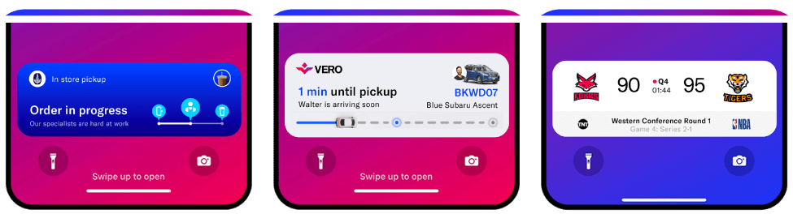

# 10 эвристик Нильсена

### Теги

ux

### Автор

NNgroup

### Источник

[https://www.nngroup.com/articles/ten-usability-heuristics/](https://www.nngroup.com/articles/ten-usability-heuristics/) 

### **Содержание**

Наглядность состояния системы

Соответствие системы реальному миру

Контроль и свобода действий пользователя

Согласованность и стандарты

Предотвращение ошибок

Распознавание, а не запоминание

Гибкость и эффективность использования

Эстетичный и минималистичный дизайн

Помогайте пользователям распознавать, диагностировать и устранять ошибки

Помощь и документация

### 10 общих принципов проектирования взаимодействия Якоба Нильсена. Они называются "эвристическими", потому что представляют собой общие эмпирические правила, а не конкретные рекомендации по использованию.

### Наглядность состояния системы

> Дизайн должен постоянно информировать пользователей о том, что происходит, посредством соответствующей обратной связи в течение разумного периода времени.
> 

Когда пользователи знают текущее состояние системы, они изучают результаты своих предыдущих взаимодействий и определяют дальнейшие шаги. Предсказуемое взаимодействие создает доверие как к продукту, так и к бренду.

### Соответствие системы реальному миру

Дизайн должен быть понятен пользователям. Используйте слова, фразы и понятия, знакомые пользователю, а не внутренний жаргон. Следуйте общепринятым в реальном мире правилам, чтобы информация отображалась в естественном и логичном порядке.

То, как вы должны создавать дизайн, во многом зависит от конкретных пользователей. Термины, концепции, значки и изображения, которые кажутся совершенно понятными вам и вашим коллегам, могут быть 

### Советы

- Убедитесь, что пользователи могут понимать значение, не прибегая к поиску определения слова.
- Никогда не думайте, что ваше понимание слов или понятий будет совпадать с пониманием ваших пользователей.
- Исследование пользователей позволит выявить привычную терминологию ваших пользователей, а также их ментальные модели, связанные с важными понятиями.

## Контроль и свобода действий пользователя

Пользователи часто совершают действия по ошибке. Им нужен четко обозначенный "аварийный выход", чтобы завершить нежелательное действие без необходимости проходить длительный процесс.

Когда людям легко выйти из процесса или отменить действие, это создает чувство свободы и уверенности. Выходы позволяют пользователям сохранять контроль над системой и избегать застревания и чувства разочарования.

### Советы

- Поддерживайте функции отмены и повтора.
- Укажите понятный способ выхода из текущего взаимодействия, например, кнопку отмены.
- Убедитесь, что выход четко обозначен и его можно найти.

## Согласованность и стандарты

Пользователи не должны задаваться вопросом, означают ли разные слова, ситуации или действия одно и то же. Соблюдайте правила платформы и отрасли.

Закон Якоба гласит, что люди проводят большую часть своего времени, используя цифровые продукты, отличные от ваших. Опыт пользователей при использовании этих продуктов определяет их ожидания. Несоблюдение последовательности может увеличить когнитивную нагрузку пользователей, вынуждая их изучать что-то новое.

## Предотвращение ошибок

Хорошие сообщения об ошибках важны, но лучшие решения в первую очередь предотвращают возникновение проблем. Либо устраните условия, которые могут привести к ошибкам, либо проверьте их и предложите пользователям возможность подтверждения, прежде чем они приступят к выполнению действия.

Существует два типа ошибок: промахи и неточности в оформлении. Промахи - это неосознанные ошибки, вызванные невнимательностью. Ошибки - это сознательные ошибки, основанные на несоответствии между ментальной моделью пользователя и дизайном.

## Распознавание, а не запоминание

Минимизируйте нагрузку на память пользователя, делая элементы, действия и опции видимыми. Пользователю не нужно запоминать информацию из одной части интерфейса в другую. Информация, необходимая для использования дизайна (например, надписи на полях или пункты меню), должна быть видна или легко извлекаться при необходимости.

У людей ограниченная кратковременная память. Интерфейсы, способствующие распознаванию, снижают количество когнитивных усилий, требуемых от пользователей.

## Гибкость и эффективность использования

Ярлыки, скрытые от начинающих пользователей, могут ускорить взаимодействие для опытных пользователей, так что дизайн будет удобен как неопытным, так и опытным пользователям. Позволяют пользователям адаптировать часто выполняемые действия.

Гибкие процессы могут осуществляться различными способами, так что люди могут выбирать тот метод, который им подходит.

## Эстетичный и минималистичный дизайн

Интерфейсы не должны содержать информацию, которая не имеет отношения к делу или редко используется. Каждая дополнительная единица информации в интерфейсе конкурирует с соответствующими единицами информации и снижает их относительную видимость.

Эта эвристика не означает, что вы должны использовать простой дизайн — главное, чтобы контент и визуальный дизайн были сосредоточены на главном. Убедитесь, что визуальные элементы интерфейса соответствуют основным целям пользователя.

## Помогайте пользователям распознавать, диагностировать и устранять ошибки

Сообщения об ошибках должны быть изложены простым языком (без кодов ошибок), точно указывать на проблему и конструктивно предлагать решение.

Эти сообщения об ошибках также должны сопровождаться визуальной обработкой, которая поможет пользователям заметить и распознать их.

## Помощь и документация

Лучше всего, если система не нуждается в каких-либо дополнительных пояснениях. Однако может потребоваться предоставить документацию, которая поможет пользователям понять, как выполнять свои задачи.

Поиск по содержимому справки и документации должен быть простым и ориентированным на задачу пользователя. Составьте его кратко и перечислите конкретные шаги, которые необходимо выполнить.