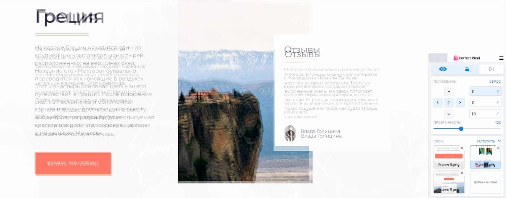
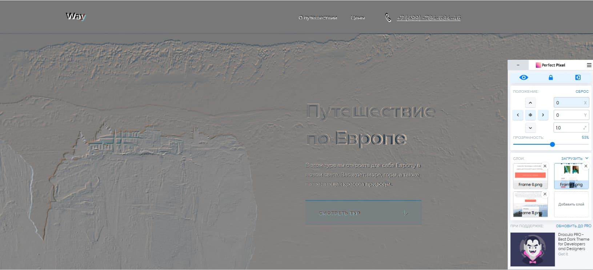
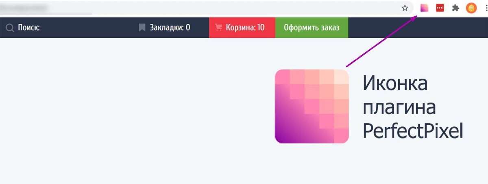
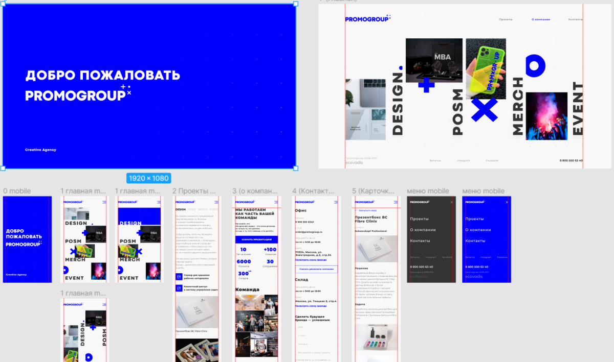

# Pixel Perfect вёрстка что это такое?

### Теги

css, html

### Автор

Саша Смыгина

### Источники

[https://htmlacademy.ru/blog/html/fonts-loading](https://htmlacademy.ru/blog/html/fonts-loading)

### Содержание

Зачем учиться Pixel Perfect вёрстке?

Как верстать под Pixel Perfect

Как проверить вёрстку с помощью PerfectPixel

Что может пойти не так?

Насколько точным должно быть совпадения?

### Процесс создания сайта начинается с разработки его дизайна. Первоначально дизайнер прорабатывает внешний вид страниц и формирует макет. После того как дизайн одобрен заказчиком, дизайнер вносит окончательные корректировки.
Заказчик, еще до реализации сайта, имеет представление о том, как должен выглядеть каждый его элемент. 

Любые изменения могут привести к тому, что он откажется от работы. Именно поэтому важно не просто выполнить верстку сайта в соответствии с образцом, но и максимально приблизить ее к утвержденному макету.

Веб-разработчики, чтобы как можно точнее соответствовать утвержденному дизайну, придерживаются принципа "Pixel Perfect". Это метод верстки, при котором размеры и отступы с макета соблюдаются с точностью до нескольких пикселей.

Если вы хотите получать еще больше такого контента, то переходите в наш телеграм канал, чтобы ничего не пропустить и первыми читать наши новости❤️🫶

## Зачем учиться Pixel Perfect верстке?

Учиться Pixel Perfect вёрстке начинающему разработчику важно по многим причинам? Во первых, это очень распространенная концепция в компаниях, которые занимаются разработкой сайтов и различных веб-приложений. Благодаря Pixel Perfect верстке вы сможете избежать огромного количество проблем с заказчиками и избежать задержек при сдаче проекта.

Во первых, из-за того что вы будете писать Pixel Perfect вёрстку с каждым последующим проектом вы заметите, как будете писать код быстрее и точнее, ведь он будет совпадать с макетом дизайнера. 

Во вторых, все мы знаем, что заказчик утверждает макет проекта еще до начала работы с кодом и поэтому ожидают, что конечный проект будет выглядеть точно также. Благодаря Pixel Perfect вёрстке вы сможете гарантировано соблюсти все размены, интервалы и детали макета в точности до каждого пикселя.

На начальном этапе обучения особое внимание следует уделить изучению этой техники, поскольку это поможет сформировать правильные навыки и подход к вёрстке. Сложные моменты и нюансы, которые вы постигнете в процессе обучения, станут крайне полезными в вашей дальнейшей работе.

Это знание поможет вам справляться с более сложными задачами и проектами, а также повысит вашу конкурентоспособность на рынке труда.

## **Как верстать под Pixel Perfect**

Чтобы вёрстка соответствовала дизайну, важно проработать детали: задать размеры, группы шрифтов, высоту строк, отступы между элементами и блоками, размеры изображений.

Для достижения сходства макета и конечного продукта разработчики используют программы и скрипты, например, X-Precise, pixLayout, Crosspixel. Но один из наиболее эффективных способов - использование плагина PerfectPixel. Он позволяет сравнить макет и вёрстку в браузере и определить, какие элементы нуждаются в доработке.

## **Как проверить вёрстку с помощью PerfectPixel**

Чтобы начать проверку вёрстки, сначала вам потребуется скачать специальный плагин. Для браузеров Chrome, Opera или Edge, рекомендуется использовать плагин под названием PerfectPixel. Этот плагин позволяет сравнить вашу вёрстку с макетом дизайна на пиксельном уровне. 

Если же вы используете браузер Firefox, то вам подойдёт Pixel Perfect Pro. Это альтернативное решение, которое также позволяет сравнить вашу вёрстку с макетом. К сожалению, для браузера Safari подобный плагин пока ещё находится в стадии разработки.

После того, как вы установите плагин в панели браузера можно увидеть розовую иконку —это и будет плагин PerfectPixel. Если плагин у вас не отображается, то добавьте его самостоятельно, для этого вам нужно будет зайти в «Расширения» (находится на панели или в настройках браузера) там вы сможете найти данный плагин и закрепить его у вас на панели для быстрого доступа и проверки макета. 

> Если плагин недоступен для работы с локальными сайтами, перейдите в раздел "Расширения" браузера и найдите PerfectPixel. Нажмите "Подробнее" и измените две настройки: "разрешить открывать локальные файлы по ссылкам" и "разрешить доступ на всех сайтах".
> 

Дальше все предельно просто, нужно экспортировать страницы макетов в формате png из приложения figma или приложения Adobe Photoshop. Следующее, что нужно будет сделать это проверить работоспособность сайта, откройте ваш браузер и установить в инструментах разработчика такую же ширину, как и у макета, что вы экспортировали. 

Краткое напоминание, как открывать среду разработчика:

> MacOS — control + command + I или fn + f12

Windows — f12

Linux — Ctrl + Shift +I
> 

Нажмите на иконку PerfectPixel и добавьте слой для сравнения - макет страницы. Загрузите макет и установите нужные размеры. Если требуется, настройте расположение макета по высоте и ширине или центру.

Верху поля с расположением есть три кнопки. Одна регулирует прозрачность слоя с макетом, вторая фиксирует слой, третья показывает разницу между сайтом и макетом в режиме инверсии цвета. Используйте их для сравнения верстки и утвержденного дизайна.

Как использовать PerfectPixel? 

> Нужно загрузить слой, настроить его и проверить в режиме прозрачности или инверсии.
> 

## Что может пойти не так?

Одни из самых распространенных ошибок, которые новички делают при Pixel Perfect вёрстке — это включают неправильное выравнивание слоёв, игнорирование межбуквенного интервала или высоты строк, и хаотичный порядок редактуры. 

Эти ошибки приводят к тому, что вёрстка начинает "ползти", а приложение раз за разом указывает на разницу в расположении элементов. Однако несмотря на сложность и нюансы этого процесса, существуют способы, которые помогут избежать подобных ошибок. 

Пример: 

> Важно обеспечить точное выравнивание слоёв и точное следование межбуквенным интервалам и высотам строк. Также нужно обратить внимание на порядок редакции, чтобы он был последовательным и логичным. Всё это поможет улучшить точность и качество вёрстки.
> 

Для начала определите положение вашего макета, вы можете выбрать центрирование или выравнивание по левому верхнему углу вашего сайта. Это первоначальное размещение служит как отправная точка для дальнейшего дизайна. Затем внимательно корректируйте отступы и размеры от верхних элементов к нижним, от левых к правым.

Такой подход к работе позволит работать гораздо быстрее и снижает риски, что вам придется что-то переделывать. Это особенно важно при работе с большими проектами, где любые изменения могут привести к значительным задержкам и дополнительным затратам. 

> Помните, что важно сохранять консистентность и соблюдать стиль и бренд вашего сайта
> 

Если же вы используете резиновую вёрстку, то особое внимание следует уделить проверке соответствия на тех же размерах экрана, которые использовал дизайнер при создании макета. Это важно, помните об этом!

В случае промежуточных состояний, когда их внешний вид не был заранее предусмотрен в макете, нет необходимости стремиться к точному воспроизведению. Работа над этими состояниями должна быть гибкой, с учетом основных принципов дизайна и удобства пользователей.

> Начинайте работу с PerfectPixel только после окончания работы над блоком или страницей, включая стили и графику. Изменения после проверки влекут за собой повторную настройку сайта под макет.
> 

## Насколько точным должно быть совпадение?

Сверстать сайт точно по макету бессмысленно из-за различий в отображении шрифтов в разных браузерах и операционных системах. Например, элементы в Chrome и Safari могут отличаться из-за настроек системы или свойств браузера. Стремление к абсолютной точности может быть потерей времени и ресурсов.

Резиновая вёрстка не обеспечивает полное совпадение с макетами, так как они создаются для определённых размеров (например, 320px, 768px и 1440px). Это достаточно для проверки фиксированной или адаптивной вёрстки, но страница с изменяющимися размерами и сеткой в промежуточных состояниях будет отличаться от макета.

Перфекционизм может усложнить код, делая сайт тяжелым и медленным. Если дизайнер допустил ошибку в макете, обсуждение правок с ним или заказчиком может помочь. Не стремитесь к идеальному совпадению: в коммерческой разработке допускаются малые погрешности в отступах. Главное - понимать принцип использования PerfectPixel.

Это все, что вам нужно!