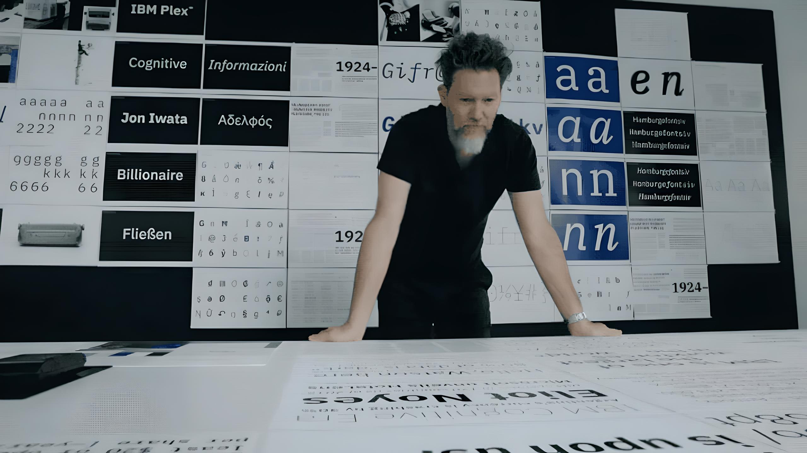
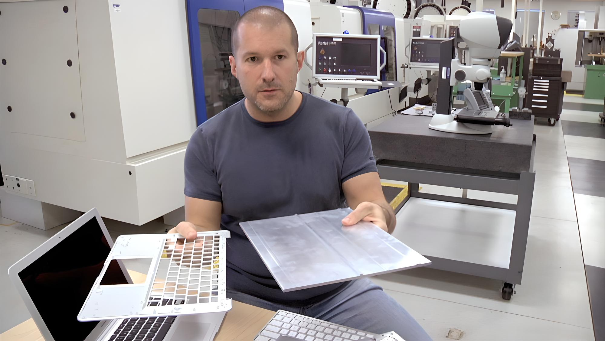

# Документальные фильмы про дизайнеров

### **Теги**

фильмы 

### **Автор**

Justy

### **Источники**

[https://media.contented.ru/vdohnovenie/kofebrejk/9-filmov-o-dizajne-i-dlya-dizajnerov/](https://media.contented.ru/vdohnovenie/kofebrejk/9-filmov-o-dizajne-i-dlya-dizajnerov/)

### **Содержание**

33 слова о дизайне

Баухаус: лицо двадцатого века

Гельветика

Аалто

«Овеществление» 

Рамс

Абстракция: Искусство дизайна

Наброски Фрэнка Гери

### О чем думал Джонни Айв? Способен ли шрифт поднять продажи? Почему предметы выглядят так, как они выглядят? Что такое дизайн? Имеет ли место искусство в архитектуре?  Ответы на эти вопросы и другие вопросы вы сможете найти в фильмах ниже

## **33 слова о дизайне**

Фильм-исследование современного дизайна в России.

В сборнике, состоящем из 33 коротких глав-видеоинтервью длительностью по две-три минуты, Артемий Лебедев, Покрас Лампас, Антон Шнайдер, Валерий Голыженков и другие известные профессионалы индустрии рассуждают о том, существует ли «русский дизайн», и если да, то в чем его особенность и самобытность.

## **Баухаус: лицо двадцатого века**

Высшая школа архитектуры и дизайна «Баухаус», основанная в Веймаере в 1919 году, — одно из наиболее впечатляющих образовательных движений в искусстве ХХ века. Влияние «Баухауса» затронуло буквально все сферы искусства: архитектуру, живопись, скульптуру, дизайн и театр. Главной целью основателей движения было сделать промышленные товары красивыми, удобными и доступными для всех — двигать дизайн в массы. Британская картина 1994 года рассказывает о том, как формировался «Баухаус», как он был устроен, кто в него входил, каким образом направление завоевало общественную любовь, приобрело последователей по всему миру и отзывается эхом до сих пор.

## **Гельветика**

Фильм о типографике, графическом дизайне и визуальной культуре в целом. Сквозь призму распространения одного шрифта в фильме рассматривается общий вопрос о том, как шрифт влияет на нашу жизнь.

## **Аалто**

Фильм о связи дизайна и архитектуры — на примере работ знаменитого финна

Иногда архитекторов и дизайнеров вдохновляют неудобства. Однажды Алвар Аалто попал на лечение в стационар, где обнаружил: медицинские заведения сконструированы непрактично и некомфортно для пациентов.

## **Овеществление**

Кино о том, что у каждой вещи, которой вы пользуетесь, есть свой дизайнер

Еще один фильм американского документалиста Хастуита. «Овеществление» — о мире предметов, о том, что можно потрогать, использовать каждый день, а затем нечаянно сломать и выкинуть.

Герои фильма — промышленные дизайнеры, работавшие как с крупными технологическими гигантами типа Apple или BMW, так и с компаниями поменьше. Помимо эстетической привлекательности и следования тенденциям моды, их интересуют и более практические соображения: как адаптировать вещь под имеющиеся станки, сделать ее производство дешевле, а применение — удобнее. 

## **Рамс**

Введение в минимализм гаджетов Braun

«Эпоха бессмысленного дизайна ради бессмысленного потребления осталась в прошлом», — бубнит себе под нос улыбчивый немецкий старичок, набирающий текст на печатной машинке. Это Дитер Рамс, ведущий дизайнер компании Braun, производящей бытовую технику.

Именно Рамс придумал функциональные элементы дизайна электронных девайсов, которые мы считаем чем-то самим собою разумеющимся. Например, помеченные разными цветами кнопки на калькуляторе. Или колесико управления громкостью, совмещенное с кнопкой включения и выключения прибора.

## **Абстракция: Искусство дизайна**

14-томная энциклопедия дизайна всего — от обложек до городов и автомобилей

Документальный сериал, снятый по заказу Netflix. Два сезона, четырнадцать эпизодов, каждый из которых посвящен отдельной фигуре и творческой сфере.

Например, в первой серии иллюстратор и карикатурист Кристоф Ниманн рассказывает, как непросто работать над обложками для The New Yorker (нужно уместить историю в один рисунок, не привязывая ее исключительно к новостной сводке), где искать вдохновение (ответ: в авангардном искусстве и Берлине) и почему важно осваивать новые инструменты и форматы, даже если кажется, что в ближайшие годы новую работу искать не придется ( оказывается, даже такому блестящему и востребованному художнику могут пригодиться элементарные навыки программирования).

Среди других героев: графический дизайнер Пола Шер, разработавшая типографику Музея современного искусства (MoMA), сотрудничавшая с Windows и журналом Esquire; автомобильный дизайнер Ральф Жиль — исполнительный директор бренда Chrysler; Бьярке Ингельс — архитектор офисов Google по всему миру и автор множества удивительных урбанистических проектов, вдохновленных, с одной стороны, функционализмом Алвара Аалто, с другой — фантастическими фильмами (жилой комплекс 8 House в предместье Копенгагена легко представить в каком-нибудь «Стартреке»).

## **Наброски Фрэнка Гери**

И это довольно точное определение: здания Гери (Музей Гуггенхайма в Бильбао, «Танцующий дом» в Праге, Концертный зал имени [Уолта](https://media.contented.ru/vdohnovenie/istoriya-dizajna/kak-uolt-disney-izmenil-animatsiyu/) Диснея), кажется, вот-вот рухнут под давлением законов физики и собственных амбиций. И тем удивительней, что их суперзвездный автор — довольно закрытый и скромный человек.

Во всяком случае, Гери постоянно отказывал документалистам и сделал единственное исключение — для Сидни Поллака, равновеликой ему звезды кинорежиссуры, снявшего «Тутси» и «Три дня Кондора». «Наброски Фрэнка Гери» стали его первым документальным фильмом. Гери согласился участвовать в съемках только по старой дружбе с Поллоком.

Но это не дружеский портрет: на экране большие профессионалы общаются на равных, спорят, критикуют работы друг друга и размышляют о смысле и назначении своего ремесла. Есть, например, грустная история про Музей дизайна Vitra в Вайле-на-Рейне, который, по мнению архитектора, был ужасающе плохо построен и не передал той тонкости, что была на чертежах. Или анекдот о том, как во время разработки офиса своей собственной компании помощник Гери предложил ем просто перевернуть проект вверх ногами. Иногда подобные спонтанные решения оказываются лучшими.

## Дополнительно

[33 слова о дизайне: показ + дискуссия](https://design.hse.ru/news/1257)