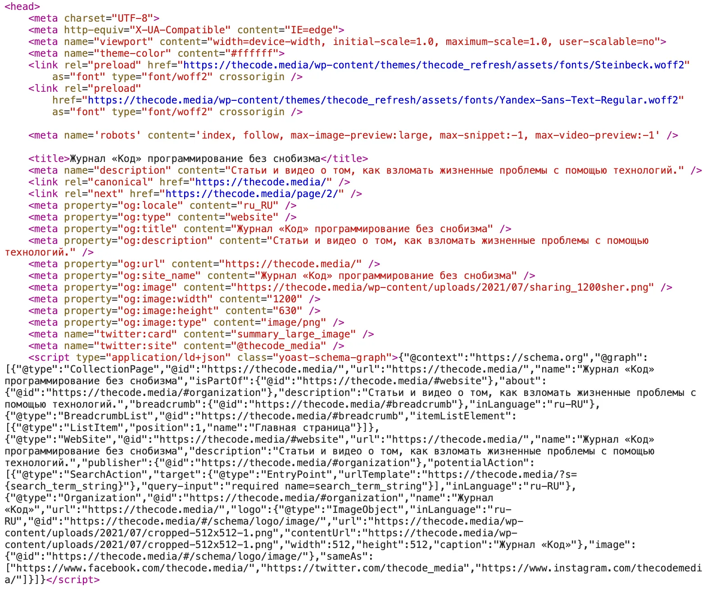
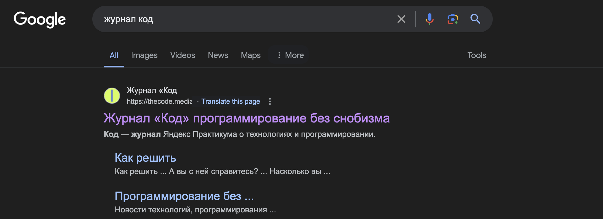
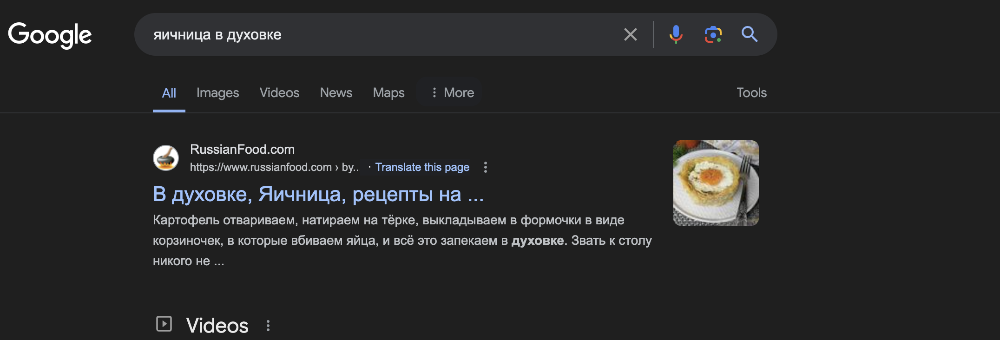

# Что такое микроразметка и зачем она ее используют?

### Теги

код, html

### Автор

Jutsy

### Источники

[https://thecode.media/kak-razrabotchiku-fokusirovatsya-na-rabote/](https://thecode.media/kak-razrabotchiku-fokusirovatsya-na-rabote/)

### Источники

https://www.magemastery.net/blog/what-is-micromarking-and-why-is-it-needed

### Содержание

 Введение 

Что такое микроразметка

Что дает разработчику ****микроразметка?

Компоненты микроразметки сайта

Внедрение микромаркировки

### Когда мы активно ищем информацию или ответы на наши вопросы в поисковой системе, те сайты, которые поисковая система находит как результаты, отображаются с некоторыми текстовыми фрагментами, или как их еще называют, сниппетами. 

По своей сути, сниппет это не что иное, как адаптированная под поиск мини-версия веб-страницы, которая включает в себя ключевые мысли и идеи этой страницы. В итоге, благодаря наличию такого сниппета, посетитель или пользователь сразу может понять, будет ли данный сайт ему полезен в его поиске, или стоит продолжить поиск и посмотреть другие варианты.

Пару строк такого простого сниппета поисковая система способна сформировать самостоятельно: она может просто процитировать отрывок веб-страницы, который содержит слова из запроса, или взять описание прямо из тега <description>.

Однако, стоит отметить, что бывают случаи, когда у сайта присутствует расширенный сниппет. Этот расширенный сниппет может включать в себя картинку или даже несколько ссылок, что делает его еще более информативным и полезным для пользователя.

Если вы хотите получать еще больше такого контента, то переходите в наш телеграм канал, чтобы ничего не пропустить и первыми читать наши новости❤️🫶

## Что такое микроразметка?

Микроразметка представляет собой уникальный код, который добавляется на веб-страницу для обеспечения более подробной и структурированной информации для машинного понимания. Изначально микроразметка была создана специально для поисковых систем, поскольку метаданные и ключевые слова не предоставляют достаточно информации для полноценной интерпретации содержимого сайта.

С течением времени другие сервисы, такие как мессенджеры и социальные сети, начали поддерживать микроразметку. Это помогает им лучше понимать содержимое веб-страницы и отображать его контент в информативном формате, что существенно улучшает пользовательский опыт.

В коде микроразметки используются специальные теги, которые содержат информацию о различных атрибутах контента веб-страницы. Эти теги могут описывать разные элементы, в зависимости от типа контента и целей его использования.

На многостраничном сайте, например, теги могут описывать разделы и наиболее важные страницы. В статье интернет-издания теги могут описывать обложку, заголовок, автора и дату публикации. На странице товара в интернет-магазине теги могут описывать фотографию товара, его цену и рейтинг. На странице с кулинарным рецептом теги могут описывать фотографию блюда, список ингредиентов, время приготовления и количество порций. На странице "О компании" теги могут описывать контактный телефон, адрес, часы работы и так далее.

Вот пример того, как может выглядеть микроразметка в коде главной страницы "Кода".

А вот как это отображается в результатах, предоставляемых поисковыми системами. Попробуйте провести сопоставление между кодом и результатами, которые вы видите на экране. Это станет наглядным примером того, как код воздействует на то, какую информацию вы получаете при использовании поисковых систем

## Что дает разработчику ****микроразметка

Микроразметка на веб-сайте - это практика, которая принесет выгоду всем участникам: пользователям и владельцам сайтов. Существует ряд преимуществ, которые могут быть получены от сайтов с микроразметкой:

- Улучшенное понимание поисковыми системами. Это означает, что пользователи смогут быстрее найти веб-страницы, которые удовлетворяют их потребностям, позволяя владельцам сайтов повысить рейтинг и видимость этих страниц в результатах поисковых систем. Это облегчает поиск информации для пользователей и увеличивает трафик для владельцев сайтов.
- Расширенные результаты поиска. Фрагменты веб-страницы делают результаты поиска сайта более привлекательными и информативными. Пользователи могут сразу увидеть, насколько результат соответствует их запросу, что позволяет владельцам сайтов получать больше кликов на свои ссылки из поисковых систем.
- Оптимизация голосового поиска. Структурированные данные помогают голосовым помощникам лучше искать подходящие сайты, улучшая их функциональность. Пользователи, которые используют голосовой поиск, получают более точные результаты, а владельцы сайтов не теряют посетителей, которые предпочитают этот метод поиска.
- Персонализация контента. С помощью микроразметки рекомендательные системы могут предлагать пользователям более подходящие рекомендации контента, что увеличивает удовлетворенность пользователей и привлекает более релевантную аудиторию для владельцев сайтов.

В дополнение ко всему вышеупомянутому, микроразметка помогает правильно отображать контент в социальных сетях, ускоряет процесс индексации сайтов и улучшает обработку данных, например, позволяет более эффективно проанализировать поведение пользователей в Google Analytics.

.webp)

## **Компоненты микроразметки сайта**

Микроразметка сайта - это сложное и важное явление, которое состоит из различных тегов и атрибутов. Эти теги и атрибуты играют критическую роль, поскольку они отвечают за определенный контент на веб-странице. 

Интересно, что некоторая часть этого контента видна посетителям сайта - это текст и изображения, которые они могут читать и видеть. Однако другая часть этого контента предназначена специально для поисковых роботов. Эти элементы не видны обычному посетителю, но они жизненно важны для оптимизации поисковой системы и обеспечения высокого рейтинга веб-страницы в результатах поиска.

### **Cловари микроразметки**

В микроразметке присутствует несколько словарей, представляющих собой наборы атрибутов, имеющих конкретные значения. Эти словари играют важную роль в представлении информации для поисковых систем и других веб-сервисов. 

Среди этих словарей, давайте обсудим наиболее распространенные и активно используемые в современном мире Интернета, их особенности и применение.

**Словари представляют собой комплексные наборы определений**, правил, типов данных и свойств, которые могут быть использованы для детального описания элементов веб-страницы в соответствии с конкретными стандартами и соглашениями. Это позволяет обеспечить структурированность и универсальность данных, что облегчает их взаимодействие и обработку.

**Синтаксис, в свою очередь, это строго определенные правила и структура** представления данных. Он определяет, как должны быть организованы и вложены элементы микроразметки, указывает на то, какие атрибуты и элементы HTML могут быть использованы для эффективного отображения информации. Кроме того, синтаксис определяет, какие свойства словаря можно применить к каждому элементу, чтобы обеспечить максимальную точность и понятность представленной информации.

> Если проще, то словари — это ЧТО описывается, а синтаксис — КАК
> 

- **Schema.org** предоставляет богатые и детализированные схемы для описания сотен разнообразных типов контента. Они охватывают широкий спектр областей, включая такие элементы, как статьи, товары, организации, события, отзывы и многие другие. Эта функциональность в основном используется для улучшения видимости и понимания контента поисковыми системами.
- **Open Graph Protocol** является универсальным инструментом, который позволяет автоматически создавать превью в социальных сетях и мессенджерах для постов с определёнными тегами и атрибутами. С помощью OGP можно указать название, описание, изображение, тип контента и другие свойства для объекта. Это обеспечивает более полное и привлекательное представление контента при его распространении в Интернете.
- **Микроформаты** представляют собой другой тип структурированных данных, который включает в себя различные форматы, такие как hCard для контактной информации, hRecipe для рецептов и hReview для отзывов. У каждого формата свой набор правил и атрибутов для описания определённых типов контента. Эти форматы помогают внедрять структурированные данные непосредственно в HTML, упрощая процесс создания и обработки контента

А вот примеры наиболее популярных и часто используемых синтаксисов микроразметки, которые активно используются в современных веб-разработках:

- JSON-LD (JavaScript Object Notation for Linked Data) - это инструмент, который позволяет добавлять структурированные данные в виде скриптов с объектами, имеющими определенные свойства и значения, которые определяются словарем. Хотя JSON-LD обычно используется с Schema.org, он также подходит для использования с другими словарями, что делает его универсальным инструментом для работы со структурированными данными.
- RDFa (Resource Description Framework in Attributes) - это технология, основанная на тегах и атрибутах XHTML, которая используется для создания RDF-графов, описывающих структуру и содержание веб-страницы. RDFa добавляет большую гибкость в работе с семантической информацией, поскольку позволяет добавлять ее прямо к HTML-коду страницы с помощью атрибутов элементов, таких как property, typeof и resource.
- Микроданные предоставляют еще один способ описания объектов и их свойств с использованием пар «атрибут — значение». Это простой и эффективный способ добавления структурированной информации к веб-контенту.
- Микроформаты были разработаны специально для определенных типов данных, таких как адреса, контактная информация, события и так далее. Это делает их идеальным выбором для конкретных типов информации, которые часто встречаются на веб-страницах.

## **Внедрение микромаркировки**

### **Статьи**

При публикации статей на сайте, что может быть особенно актуально для интернет-магазина с блогом или разделом советов от экспертов, используются следующие атрибуты:

- Заголовок: это название материала, которое представляет собой ключевой элемент, отражающий его суть.
- datePublished: дата публикации, которая позволяет читателю понять, насколько актуальна информация.
- Изображение: визуальный компонент статьи, который привлекает внимание и может дополнить текстовую информацию.
- ArticleBody: основной текст статьи, содержащий основную информацию и идеи.
- Автор: человек, который написал статью.
- Издатель: название ресурса, где была опубликована статья.

Еще одним важным элементом являются "панировочные сухари". Это система навигации на сайте, демонстрирующая структуру и вложенность страниц. Можно реализовать как линейную цепочку навигации, так и систему с возможностью возврата на главную страницу или к каталогу товаров. Хлебные крошки повышают уникальность фрагмента, появляясь в результатах поиска.

Разметка хлебных крошек осуществляется с помощью следующих тегов:

- itemscope: указание на описываемый объект.
- itemtype: указание типа объекта. Если элемент принадлежит хлебным крошкам, то в [Schema.Org](http://schema.org/) он будет выглядеть так: itemtype=https://schema.org/BreadcrumbList.
- itemprop="itemListElement": указывает, принадлежит ли элемент списку.
- itemprop="item": указывает на ссылку.
- itemprop="name": указывает имя хлебной крошки.
- мета itemprop="position" content="%number%": указывает положение элемента в цепочке навигации.

Микромаркировка товаров в интернет-магазине также является важной частью SEO-оптимизации. Google рекомендует устанавливать микроразметку на разделы и страницы с ассортиментом товаров для интернет-магазина: поисковые боты могут использовать эти данные для создания сниппета, который предлагает пользователю перейти по ссылке.

Для товаров обычно достаточно использовать следующие атрибуты: name (имя), description (описание), image (изображение), Price (цена) и PriceCurrency (валюта). Если вы хотите добавить отзывы в сниппет, поле AggregateRating является обязательным.

### **Проверка микроразметки на наличие ошибок**

Проверка готовой разметки на наличие ошибок является критически важным этапом, поскольку поисковым роботам доступны только данные, которые структурированы правильно. В Google вы можете найти инструмент для этого на странице валидатора. Этот инструмент не только выявляет даже самые незначительные ошибки, но и предлагает вам возможность их исправить, что очень удобно.

Теперь подведем итоги. Микроразметка важна для того, чтобы сделать сниппеты более заметными для пользователей. Это может оказать влияние на рейтинг вашего сайта через поисковое поведение пользователей. Поэтому, когда вы размечаете контент, убедитесь, что все атрибуты написаны правильно и что нет ошибок. Если ошибки все же возникают, валидаторы поисковых систем могут помочь вам проверить код разметки и исправить эти ошибки. Главное, не забывайте регулярно проводить эту проверку.

А что дальше? В следующий раз наша команда будет работать над созданием расширенного сниппета для вашего сайта. Этот сниппет не только улучшит визуальное восприятие вашего сайта, но и поможет увеличить охват аудитории. 

Подписывайтесь на наши обновления, чтобы всегда быть в курсе последних новостей и не пропустить этот важный этап в развитии вашего сайта.