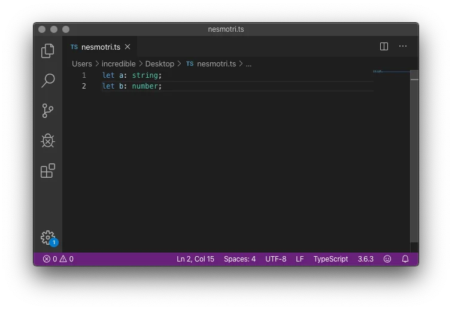

# TypeScript — как JavaScript?

### Теги

JavaScript, Языки Программирования

### Автор

Александром Штыковым

### Источники

[https://thecode.media/typescript/](https://thecode.media/typescript/)

### Содержание

Строгие типы данных

Поиск ошибок

Классы и интерфейсы

Совместимость TypeScript c JavaScript 

### Как же избегать проблем с JavaScript в больших проектах, спросите вы. JavaScript был создан для простых веб-скриптов, поэтому авторы сделали его легким для понимания и изучения для разработчиков. Но со временем язык стал популярным и начал использоваться везде где только это стало возможно, как мы знаем он используется и с клиентской стороны и с серверной, из-за чего и возникли проблемы на больших проектах.

Но благодаря TypeScript, который был создан в Microsoft в 2012 году все становится немного проще, ведь он исправляет некоторые недостатки JavaScript и не требует особых усилий для изучения. Давайте разберемся в чем же отличие их между собой. 

Если вы хотите получать еще больше такого контента, то переходите в наш телеграм канал, чтобы ничего не пропустить и первыми читать наши новости❤️🫶

## Строгие типы данных

Одной из ключевых особенностей языка программирования JavaScript является динамическая типизация. Это означает, что тип переменных задается нестрого, что позволяет, например, в любом участке кода преобразовать число в строку. На первый взгляд, это может показаться не столь критичным, особенно если один разработчик работает над небольшим проектом для веб-сайта и имеет достаточно глубокие знания в области кодирования. 

Однако в контексте больших, масштабных проектов, где задействовано множество разработчиков, такая особенность может стать источником ошибок и проблем. Это особенно актуально в случаях, когда разработчики не полностью разбираются в нюансах языка JavaScript или не обладают достаточным опытом работы с динамической типизацией

> В TypeScript типизация строгая — указать тип переменной нужно при её создании, а изменить в будущем будем нельзя
> 

Давайте приведем пример: 

**let a: string;** — в нашем программном коде мы только что создали переменную, которую мы обозначили как "a". Мы также указали, что эта переменная является строкой. Это означает, что, независимо от того, какие действия будут произведены с этой переменной в дальнейшем, она останется строкой и не превратится в число случайным образом или из-за невнимательного программирования.

Однако, если вам нужно создать переменную, которая может изменять свой тип в зависимости от условий или данных, вы можете задать переменную без конкретного типа. Это дает вам гибкость в программировании, позволяя изменить тип переменной во время работы системы, если это станет необходимым для выполнения определенных задач или функций.

let any: any;  — В данном контексте, мы уже обозначили переменную под названием "any", которая может быть любого типа. Это концепция очень важна, так как она позволяет нам максимально гибко работать с данными в TypeScript.

В TypeScript существуют типы данных, которых нет в JavaScript. Одним из самых ярких примеров является **enum** - перечисление. Это особый тип данных, который позволяет нам определить набор именованных констант и использовать их в коде, что упрощает чтение и написание кода

Например: 

> num iPhonePrice {
> 
> 
> XR = 799,
> 
> XI = 899,
> 
> XII = 999};
> 

Мы создали перечисление, которое мы обозвали “iPhone”, которое содержит цены на различные варианты моделей iPhone.

В будущем, когда нам потребуется использовать это перечисление, мы можем легко его вызвать и подставить нужное значение. Например, создадим переменную под названием total, укажем, что она представляет собой число, и присвоим ей в качестве значения стоимость iPhone XR из нашего перечисления.

Таким образом, всякий раз, когда нам нужно будет обращаться к стоимости конкретной модели iPhone, мы сможем использовать наше перечисление, которое мы создали, что значительно упростит процесс и увеличит читаемость нашего кода

## **Поиск ошибок**

Ошибки, связанные с динамической типизацией в JavaScript, обычно обнаруживаются только после того, как код уже был написан. Это означает, что для их обнаружения придется запустить код в определенной среде, например VSCode. 

В свою очередь, TypeScript предлагает совершенно другой подход для поиска и устранения ошибок, мы сможем проверять код не после его написания, а прямо во время в редакторе, благодаря такому подходу разработчик может упростить себе процесс отладки кода, а также находить и исправлять ошибка, что покажет на выходе более качественный проект. 

Как и было упомянуто ранее, писать на TypeScript можно в любом софте, который понимает язык из коробки или с помощью внешнего плагина, давайте рассмотрим все это в VsCode.

Здесь мы можем увидеть 2 переменные, первая это «a» которая является строкой, а вторая «b»  и она является числом, давайте попробуем присвоить переменной «a» число, например 12, правда если мы так сделаем, то у нас высветится ошибка

.webp)

TypeScript подсказывает нам, что мы не можем задать значение 12 для переменной «a». Потому что «a» должно быть строкой, а 12 — число. Попробуем присвоить не 12, а «12», и ошибка пропадёт

Это является на самом деле больши плюсом и значительно упрощает работу с проектом

## **Классы и интерфейсы**

В TypeScript более продуманно реализованы некоторые ключевые концепции объектно-ориентированного программирования (ООП), включая такие важные элементы, как классы и интерфейсы

Что такое интерфейс в TypeScript? Интерфейс в TypeScript — это способ описания структуры объекта, который включает в себя список свойств и их типы. Это дает нам возможность установить определенные требования к форме объекта. 

Пример такого интерфейса:

> interface IUser {
    name: string,
    age: number,
}
> 

Благодаря такому интерфейсу мы сможем создать нового пользователя, пример:

> const alexey: IUser = {
     name: Alexey,
     age: 18,
}
> 

Интерфейсы помогают нам избежать ошибок. Иногда разработчик может добавить новое свойство в объект или сделать ошибку в названии старого свойства. В обычном JS это не остановит программу - просто в объекте появится еще одно свойство, но с ошибкой в названии. Из-за этого в коде могут появиться непонятные ошибки, которые в дальнейшем будет сложно найти и которые будут затормаживать вашу работу 

С типизацией такие ошибки проще избежать - если вы ошиблись в названии свойства, вы увидите ошибку и сможете ее сразу же исправить

Теперь давайте создадим интерфейс пользователя с такими полями, как: «Имя» и «Возраст», а после на его основе создадим пользователя Irina со свойствами «Имя», «Возраст» и «Пол». Редактор кода начнем ругаться на разработчика, ведь в интерфейсе пользователя есть только два свойства: Имя» и «Возраст», а третьего свойства по просту не существует, на что он вам и укажет

.webp)

## **Совместимость TypeScript c JavaScript**

После того как вы проведете процесс компиляции кода на TypeScript, в результате будет создан стандартный код JavaScript. Этот сгенерированный код можно без проблем и задержек использовать в вашем проекте. Одним из преимуществ TypeScript является то, что вы можете постепенно переписывать ваш проект на этом языке. 

Это можно делать буквально по частям, т.е. вы можете тихо и мирно перерабатывать модули один за другим, когда у вас будут на это ресурсы. Главное преимущество этого подхода заключается в том, что в процессе такой постепенной переработки не возникнет никаких конфликтов между различными модулями вашего проекта.