# Где искать вдохновение UI/UX дизайнерам. Подборка 2

### **Теги**

насмотренность, UI/UX

### **Автор**

Justy

### **Содержание**

Mobbin

SaaSFrame

Designvault

Appshots

Banani

Screenlane

Chamjo

Design Spells

Handheld

Recent.design

Nicelydone

UI8

### Обходили весь интернет и собрали лучшие сайты для продуктовых дизайнеров😇

### Мы часто ходим по интернету и собираем полезности, поэтому переходите в наш [телеграм канал](https://t.me/justynews), чтобы ничего не пропустить и первыми читать наши новости❤️🫶

## [**Mobbin**](https://mobbin.com/browse/ios/apps)

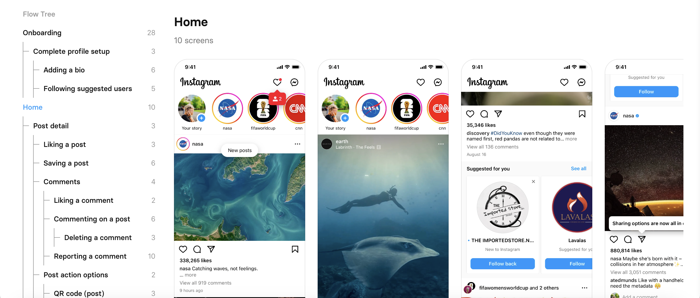

Лучшее место для того, что смотреть, как сделаны дизайн и флоу известных приложений 

## [**SaaSFrame**](https://www.saasframe.io/)

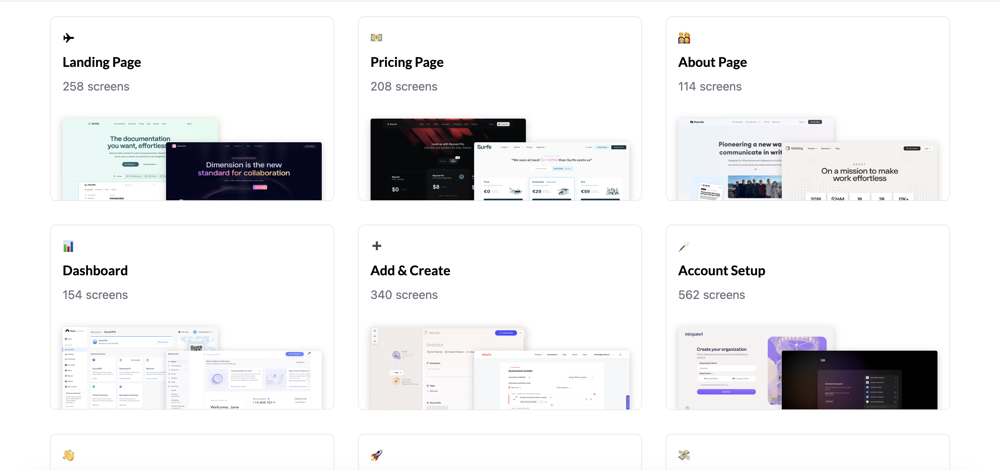

SaaSFrame ориентирован на UX/UI-дизайнеров с уклоном в разработку пользовательского опыта SaaS-приложений. Основное отличие — действительно свежие стильные кейсы и каталог экранов email-рассылок.

## [**Designvault**](https://designvault.io/mobile/)

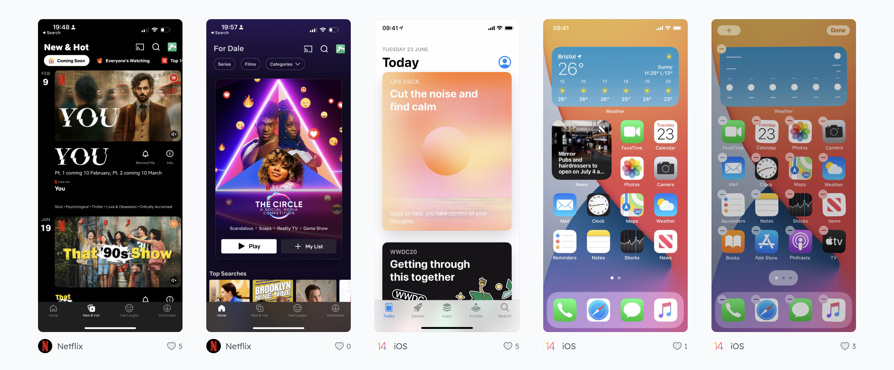

Просматривая обширную библиотеку реальных дизайнов приложений на этой платформе, дизайнеры могут получить ценную информацию о том, что работает, а что нет в мире дизайна цифровых продуктов. Вы можете узнать, как другие дизайнеры решали распространенные проблемы дизайна, увидеть, как они реализовали конкретные шаблоны пользовательского интерфейса, и получить вдохновение для своих собственных дизайнерских проектов.

## [**Appshots**](https://appshots.design/apps/)

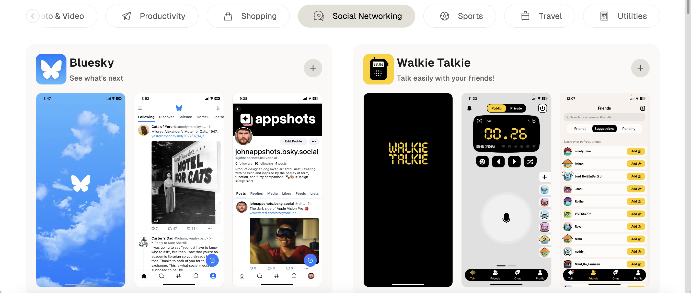

Приложения, доступные на этой платформе, тщательно отбираются благодаря чистому и современному дизайну, что делает их отличным примером передового опыта в дизайне цифровых продуктов.

## [**Banani**](https://www.banani.co/references)

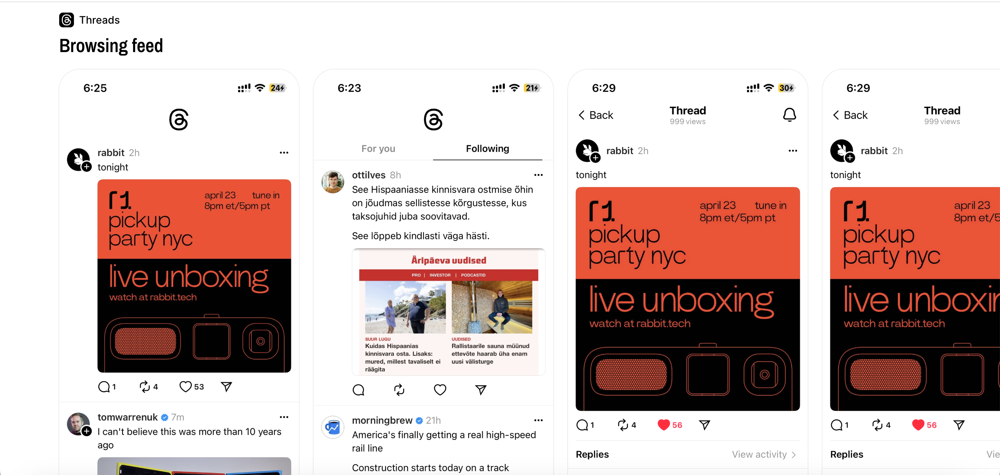

Отличная коллекция мобильных приложений с лучшим дизайном. Все приложения структурированы в виде потоков, поэтому их легко просматривать и находить нужный экран. Никакой регистрации не требуется.

## [**Screenlane**](https://screenlane.com/)

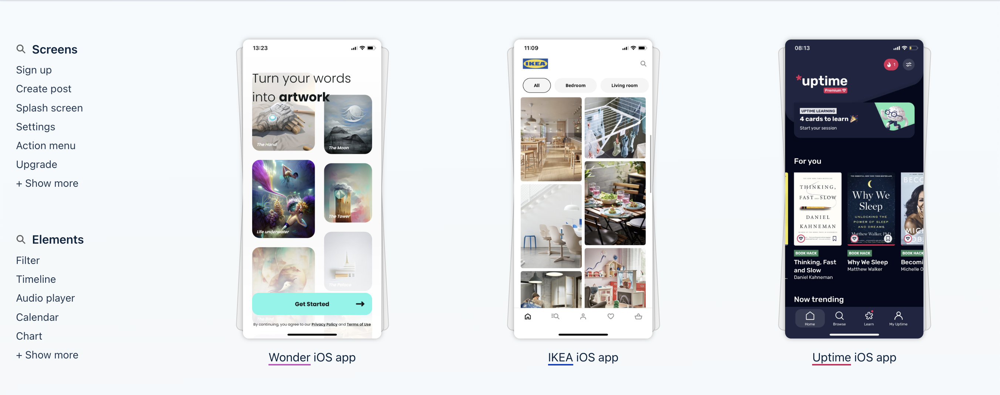

Достойная бесплатная альтернатива Mobbin. Каждый дизайн помечен тегами, поэтому вы можете фильтровать их по типу экрана, элементам на экране и категориям продуктов.

## [**Chamjo**](https://chamjo.design/)

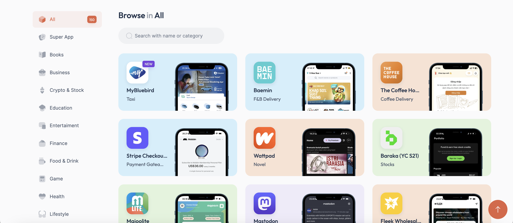

Совершенно уникальная справочная библиотека, ориентированная на азиатские приложения с возможностями поиска и фильтрации. У него также есть модель, в которой вы можете вносить свой вклад и добавлять дизайны, которые вам нравятся.

## [**Design Spells**](https://www.designspells.com/)

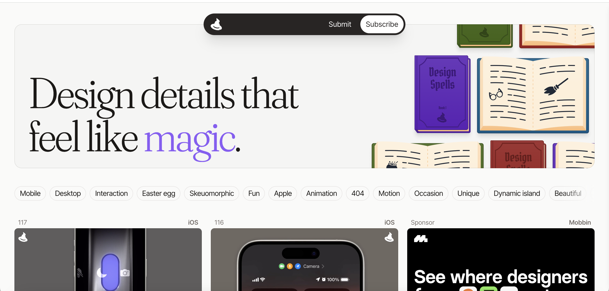

Удобная библиотека микровзаимодействий и анимации внутри мобильных приложений и веб-сайтов. На данный момент существует около 100 волшебных анимаций и деталей дизайна, которые вы можете использовать в качестве вдохновения.

## [**Handheld**](https://handheld.design/)

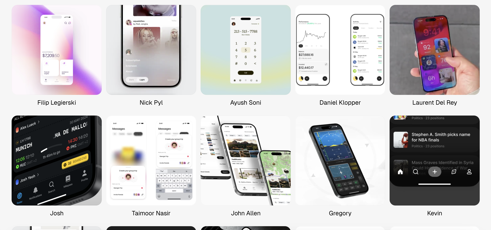

Кураторские и тщательно подобранные ссылки на мобильные приложения из X или Twitter (как вы предпочитаете). Помимо поиска вдохновения, вы можете найти новых дизайнеров, за которыми можно подписаться в Твиттере, чтобы обогатить свою социальную ленту.

## [**Recent.design**](https://recent.design/)

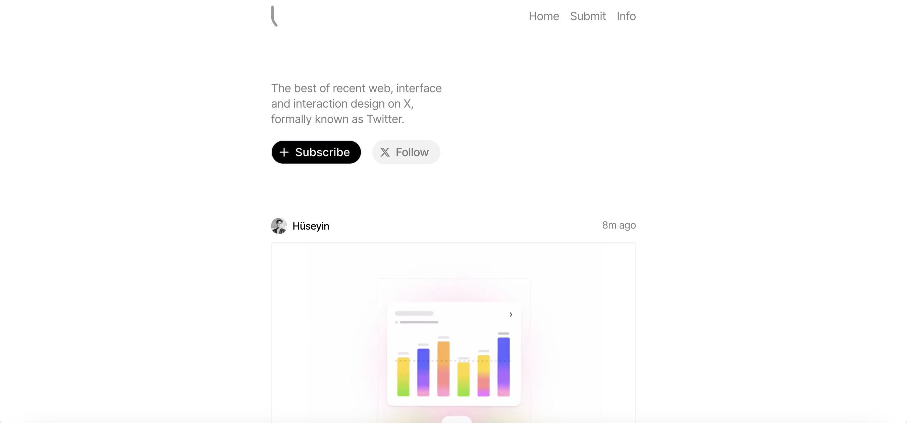

Как и Handheld, это коллекция лучших последних интерфейсов и интерактивного дизайна в Твиттере.

## [**Nicelydone**](%D0%A2%D0%B5%D0%BB%D0%B5%D0%B3%D1%80%D0%B0%D0%BC%20%D0%BA%D0%B0%D0%BD%D0%B0%D0%BB%D1%8B%20%D0%B4%D0%BB%D1%8F%20%D0%B2%D0%B4%D0%BE%D1%85%D0%BD%D0%BE%D0%B2%D0%B5%D0%BD%D0%B8%D1%8F%20%D0%9F%D0%BE%D0%B4%D0%B1%D0%BE%D1%80%D0%BA%D0%B0%20b7e360a2e88c4dfd99c7007d29bdc34a.md)

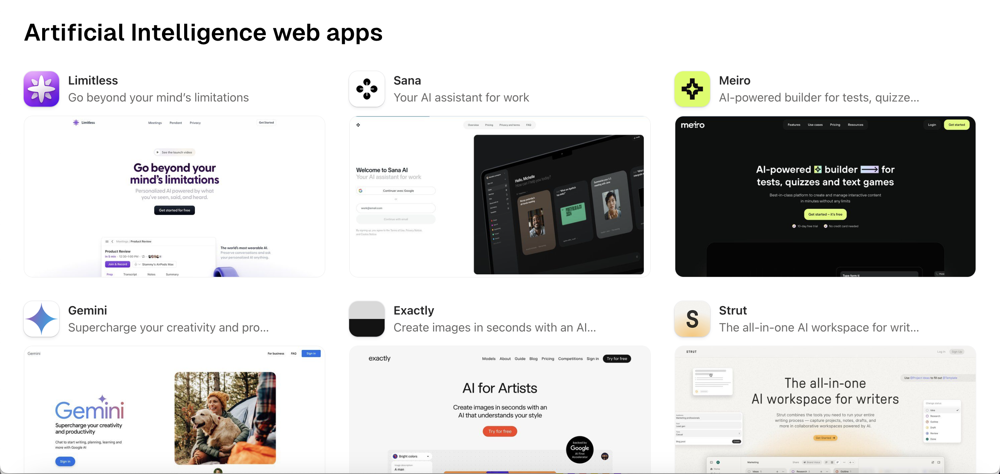

Библиотека веб-приложений и сервисов с фильтрацией по категориям 

## [**UI8**](https://ui8.net)

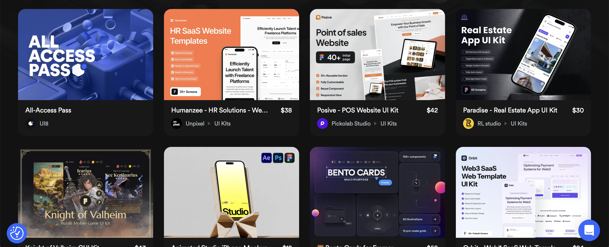

UI8 - ведущий сайт для мобильных устройств, предлагающий множество ресурсов и шаблонов UI/UX дизайна. Много мобильного веба, но и приложения проскакивают