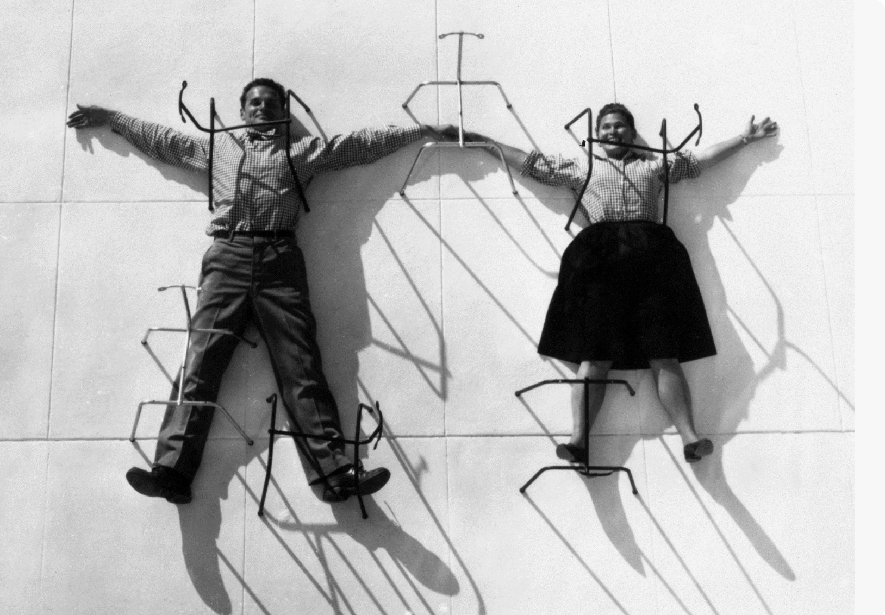

# Дизайнеры без компьютеров: отцы основатели, о которых нужно знать

### **Теги**

дизайнеры 

### **Автор**

Justy

### **Источники**

[https://media.contented.ru/vdohnovenie/istoriya-dizajna/chto-dizayneru-nuzhno-znat-pro-shkolu-bauhaus/](https://media.contented.ru/vdohnovenie/istoriya-dizajna/chto-dizayneru-nuzhno-znat-pro-shkolu-bauhaus/)

### **Содержание**

Вальтер Гропиус

Оскар Шлеммер

Йоханнес Иттен

Йост Шмидт

Марсель Брейер

Пауль Рэнд

Дитер Рамс

Рэймонд Лоуи 

Чарльз и Рэй Имз

Ле Корбюзье

Мис ван дер Роэ 

Ээро Аарнио

### Мы представляем основоположников дизайна, которые внесли огромный вклад в его развитие. Именно результат их творчества, мы видим каждый день. Очень рекомендуем почитать о каждом из них поподробнее

### А еще, переходите в наш [телеграм канал](https://t.me/justynews), чтобы ничего не пропустить и первыми читать наши новости❤️🫶

## **Вальтер Гропиус**

Один из основателей и первый директор школы Баухаус — это архитектор Вальтер Гропиус. Он разработал особую методику обучения, которая включала геометрию, физику, химию, танец, ткачество, гончарное дело и другие ремесла. Это позволяло будущим архитекторам и дизайнерам лучше понимать окружающую среду и свойства материалов.

## **Гропиус и Баухауз**

В Баухаузе Гропиус уделял большое внимание ручному декоративно-прикладному искусству, индивидуальности и экспрессионизму. В середине 1920-х годов он начал фокусироваться на функциональном, доступном дизайне и промышленном производстве, адаптированном к современному миру машин, радиоприемников и скоростных автомобилей.

## **Основные архитектурные принципы**

1. Единство искусства, ремесла, промышленности и архитектуры.
2. Разрыв с архитектурными традициями прошлого — необходимая мера.
3. Архитектура не может существовать вне культурно-исторического контекста.
4. Общественное благо превыше всего.
5. Здание должно соответствовать конструктивной форме.
6. Духовные интересы не менее важны, чем утилитарные.

## **Оскар Шлеммер**

Художник и скульптор Оскар Шлеммер придумал [логотип](https://media.contented.ru/glossary/logotip/) Баухауса. Он преподавал в школе с 1921 по 1929 год и руководил мастерскими металлических изделий и скульптуры.

## **Биография и Художественный стиль**

Шлеммер был известен своими работами, охватывающими широкий спектр художественных стилей и направлений XX века, от геометрической абстракции и кубизма до классицизма. В 1913 году он начал создавать картины, на которых изображались человеческие фигуры в геометрически абстрактной манере, напоминающие орнамент. В 1920 году он получил приглашение в Веймар, где руководил мастерской металлических изделий и скульптуры в Баухаузе. В 1923 году его стиль был подвергнут влиянию метафизической живописи, и фигуры на его картинах стали располагаться на чётко разделённой поверхности в хореографическом построении.

## **Карьера и Признание**

Шлеммер был известен как оформитель сцены и постановщик балетов в Баухаузе. Он также был профессором в Бреславльской Академии с 1929 по 1932 год. В 1933 году контракт с Берлинской Объединённой школой искусств был расторгнут после прихода национал-социалистов к власти. В это время его стиль изменился, и он начал создавать работы с более мягкими и округлыми формами.

## **Йоханнес Иттен**

Создатель знаменитого цветового круга Йоханнес Иттен разработал для Баухауса вводный курс по основам формообразования и работы с материалами: металлом, деревом, камнем, бетоном и другими фактурами.

Иттен считал цвет такой же важной составляющей в архитектуре, как форма или материал. В 1961 году, уже после окончания эпохи Баухауса, он выпустил книгу «Теория цвета», которая сейчас считается классикой дизайна.

## **Ключевые идеи Иттена**

1. **Контраст**: Иттен подчеркивает важность контрастов в искусстве, особенно между светлым и темным. Он считает, что контрасты позволяют создавать более выразительные и интересные композиции.
2. **Умение видеть**: Иттен отмечает три основных тенденции, которые характеризуют способности к пониманию проблем цвета у художников. Он различает «эпигоны» — тех, кто не имеет самостоятельного мировоззрения и зависит от решений других, и тех, кто может мыслить и создавать самостоятельно.
3. **Гармония**: Иттен подчеркивает важность гармонии в изобразительном искусстве. Он считает, что гармония достигается при равновесии между диссимиляцией (расход сил на восприятие цвета) и ассимиляцией (восстановление сил).
4. **Цветовые круги и треугольники**: Иттен использует цветовые круги и треугольники для определения гармоничных сочетаний различных цветов. Он считает, что гармоничные сочетания должны быть основаны на нейтральном сером цвете, который создает состояние равновесия.
5. **Педагогика**: Иттен был сторонником индивидуального подхода в педагогике. Он считает, что учитель должен учитывать природные данные и темперамент ученика, а не просто следовать жестким программам и методикам

## **Влияние на Баухауз**

Иттен был одним из основателей Баухауза, где он преподавал и развивал свои идеи о контрастах и гармонии в изобразительном искусстве. Он стремился преодолеть старый узкокорпоративный подход в обучении художников и развить у них мастерство свободного владения формой и цветом

## **Йост Шмидт**

Йост Шмидт был студентом школы Баухаус с 1919 по 1925 год и обучался в мастерской резьбы по дереву, а затем стал преподавать в школе каллиграфию и возглавил мастерскую скульптуры.

Шмидт стал известным графическим дизайнером и мастером [типографики](https://media.contented.ru/glossary/tipografika/). Он много работал с графикой и создавал концептуальные плакаты. Одни из самых известных его работ — это плакат для выставки Баухауса в 1923 году в Веймаре и «Дизайн механической сцены» 1925 года.

## **Марсель Брейер**

Еще один ученик Баухауса, который остался преподавать в школе — это Марсель Брейер. Он занимался преимущественно дизайном мебели, разработал модель стульев для аудиторий Баухауса в городе Дессау, а также создал знаменитый консольный стул Wassily, который посвятил Василию Кандинскому. Сейчас он является частью коллекции Museum of Modern Art в Нью-Йорке.

## Пауль Рэнд

Пол Рэнд (1914-1996) — выдающийся американский арт-директор и дизайнер, который внес значительный вклад в развитие графического дизайна. Он был почётным профессором графического дизайна в Йельском университете и преподавал с 1956 по 1969 год и с 1974 по 1985 год. Рэнд был включён в Зал славы Нью-Йоркского клуба арт-директоров в 1972 году.

## **Влияние на дизайн**

Рэнд был одним из первых специалистов, которые показали, что визуальный стиль компании и продукта — это не только вопрос эстетики, но и действенный способ решать задачи бизнеса. Он создавал корпоративные стили, которые привлекали внимание и получали высокую оценку, включая логотип для Next Computer, который был создан в сотрудничестве с Стивом Джобсом.

## Дитер Рамс

Дитер Рамс, немецкий промышленный дизайнер, является одним из наиболее влиятельных и важных дизайнеров в истории промышленного дизайна. Он известен своими принципами дизайна, которые он развивал в своей работе. 

Некоторые из его основных принципов включают:

1. **Хороший дизайн – инновационный дизайн**. Дизайн должен быть не только функциональным, но и инновационным, чтобы вносить положительный вклад в окружающую среду и экономить ресурсы.
2. **Меньше дизайна в дизайне**. Рамс подчеркивает важность простоты и минимальизма в дизайне, чтобы создавать продукты, которые эффективно выполняют свои функции.
3. **Дизайн не имеет ничего общего с искусством**. Дизайн должен быть направлен на создание полезных и функциональных продуктов, а не на создание искусства.
4. **Дизайн должен основываться на человеческой психологии**. Хороший дизайн учитывает человеческие потребности и поведение, чтобы создавать продукты, которые эффективно решают задачи.
5. **Ненавязчивость**. Дизайн должен быть неброским, ясным и минимальным, чтобы не перегружать пользователя информацией.
6. **Иллюстрации передают то, что слова и фотографии не могут**. Иллюстрации могут эффективно передавать сообщения, которые лучше резонируют с аудиторией.
7. **Дизайн должен быть эволюционным**. Рамс подчеркивает важность постепенного улучшения дизайна, а не революционных изменений.
8. **Дизайн должен быть функциональным**. Продукт должен быть функциональным и эффективно выполнять свои задачи.
9. **Дизайн должен быть инновационным**. Дизайн должен вносить новые идеи и технологии, чтобы создавать продукты, которые отличаются от существующих.
10. **Дизайн должен быть простым**. Рамс подчеркивает важность простоты и минимальизма в дизайне, чтобы создавать продукты, которые эффективно выполняют свои функции.

## Рэймонд Лоуи

Реймонд Лоуи был одним из наиболее влиятельных дизайнеров XX века, который оставил свой след в различных отраслях, включая автомобильную промышленность, железнодорожный транспорт и космос. Некоторые из его наиболее значимых достижений включают:

1. **Автомобильный дизайн**: Лоуи был пионером коммерческого дизайна и разработал понятия «корпоративный стиль» и «эстетическая форма изделия». Он известен своими проектами, такими как Starliner Coupe 1953 года, который считается одним из красивейших автомобилей в истории.
2. **Железнодорожный транспорт**: Лоуи проектировал локомотивы и пассажирские купе, а также разработал обтекаемые формы, которые стали характерными для стиля Streamline.
3. **Космос**: Лоуи работал с NASA и создал интерьер орбитальной станции «Скайлэб» (1967-1973). Он также консультировал разработчиков и помог создать удобную станцию для людей, которые находились в невесомости.
4. **Промышленный дизайн**: Лоуи был известен своими проектами, такими как дизайн бутылки Coca-Cola (1955), пачки сигарет Lucky Strike и самолета. Он считал, что дизайн должен учитывать психологию потребления и быть функциональным, коммерчески выгодным и эстетически привлекательным

## Чарльз и Рэй Имз

Самым важным вкладом Имзов в дизайн стало их изобретение технологии формовки прессованной фанеры, которая позволила создавать удобную и эргономичную мебель. 

Их знаменитое кресло Eames Lounge Chair, выпущенное в 1945 году, до сих пор считается одним из самых комфортных стульев в мире. 

Имзы не ограничивались только мебелью - они также внесли вклад в архитектуру, графический дизайн и кинематограф. 

Их собственный дом в Лос-Анджелесе, построенный в 1949 году, стал одним из самых значимых жилых проектов послевоенного времени благодаря инновационному использованию материалов и оригинальному дизайну

Чарльз и Рэй Имз смотрели на дизайн как на способ решения проблем и предлагали свежие, изобретательные решения. Их творческий союз стал одним из самых плодотворных в истории дизайна XX века. Имзы навсегда вошли в историю как одни из самых важных и влиятельных дизайнеров своего времени.

## **Ле Корбюзье**

**(Le Corbusier)** - Швейцарско-французский архитектор, один из пионеров модернистской архитектуры.

Ле Корбюзье, также известный как Шарль-Эдуар Жаннере-Гри, был французским архитектором, который внес значительный вклад в развитие модернистской архитектуры. Он родился в 1887 году в Швейцарии и начал свою карьеру в 13 лет, когда поступил в Школу искусств в Шо-де-Фоне, где изучал декоративно-прикладное искусство

Ле Корбюзье является автором пяти принципов, которые он называл «пятью отправными точками современной архитектуры» и которые были сформулированы в 20-е годы XX века. Эти принципы включают:

1. Столбы-опоры, которые позволяют поднимать здание или его часть, чтобы освободить место под домом.
2. Плоские крыши-террасы, на которых можно развести сад или устроить место для отдыха.
3. Свободная планировка внутреннего пространства, позволяющая создавать, например, двухуровневые квартиры.
4. Ленточные окна, проходящие вдоль всего фасада, которые обеспечивают дополнительный доступ света в помещение.
5. Свободный фасад, который может принимать любые формы или быть сделанным из стекла.

Ле Корбюзье также известен своими проектами в СССР, включая здание Центросоюза в Москве, которое было построено в 1937 году. Он работал над этим проектом вместе со своим братом Пьером Жаннере и советским архитектором Николаем Колли

## **Мис ван дер Роэ**

**(Mies van der Rohe)** - Немецко-американский архитектор, один из основателей стиля "международного стиля".

Людвиг Мис ван дер Роэ был одним из ведущих архитекторов-модернистов XX века, известным своими инновационными идеями в области архитектуры и дизайна. Основные аспекты его творчества:

## **Свободная планировка**

Мис ван дер Роэ разработал концепцию свободной планировки зданий, при которой несущие стены были сведены к минимуму, а внутреннее пространство могло легко трансформироваться с помощью передвижных перегородок. Это позволяло адаптировать здания под меняющиеся функции.

## **Использование стекла и стали**

Архитектор активно использовал стекло и сталь в своих проектах, стремясь к прозрачности и легкости конструкций. Он предлагал проекты стеклянных небоскребов, которые вызывали неоднозначную реакцию, но демонстрировали новаторский подход.

## **Функциональность и простота**

Мис ван дер Роэ придерживался принципа "форма следует за функцией", создавая функциональные и лаконичные здания. Он считал, что архитектура должна быть разумной и ясной, без лишнего декора.

## **Влияние на мировую архитектуру**

Людвиг Мис ван дер Роэ оказал огромное влияние на развитие архитектуры XX века, став одним из основоположников интернационального стиля. Его идеи и проекты вдохновляли многих архитекторов, а в его честь была учреждена престижная архитектурная премия.

## **Ээро Аарнио**

Аарнио известен своими необычными и функциональными дизайнерскими проектами, которые сочетают эргономику и индивидуальность. Он предпочитает работать с материалами будущего, но сохраняет традиционные методы производства. Аарнио также создал детскую мебель, например, кресло "Pony", которое может использоваться как кресло, так и игрушка.

## Дополнительно

[**Вальтер Гропиус — основатель Баухауза и первопроходец модернизма**](https://losko.ru/walter-gropius/)