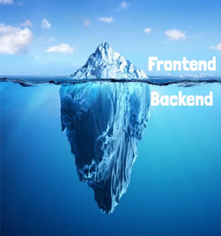

# Как стать бэкенд-разработчиком

### Теги

 код

### Автор

Бхану Чадда

### Источники

 [https://medium.com/@bhanuchaddha/super-backend-man-how-to-become-an-awesome-backend-developer-64e0f692ea6](https://medium.com/@bhanuchaddha/super-backend-man-how-to-become-an-awesome-backend-developer-64e0f692ea6)

### Содержание

Введение 

Кто такой бэкенд-разработчик?

Какие обязанности у бэкенд-разработчик?

Что нужно знать чтобы стать разработчиком на бэкенде?

Какие языки программирования используют?

### Вы, вероятно, сталкивались с изображением ниже и не один раз, и если говорить честно то можно предположить, что Айсберг мог бы быть еще глубже и непостижимее. В течением учебы и жизни можно ни раз столкнуться с этим удивительным и сложным вопросом: «Что должен знать каждый бэкенд-разработчик?». 

Этот вопрос крайне сложен для ответа, учитывая множество аспектов и нюансов, которые входят в обязанности бэкенд-разработчика.

### Создание качественного бэкэнда - задача, требующая не только глубоких знаний, но и большого опыта. Все ключевые компоненты и большинство бизнес-правил находятся именно в серверной части приложения. 

Это своего рода мозг всей вашей системы, главный узел, от работы которого зависит успешность всего проекта. Поэтому, важность того, чтобы серверная часть была надежной, удобной в обслуживании и расширяемой, сложно переоценить.

Когда мы говорим о том, что серверная часть должна быть «надежной, поддерживаемой и расширяемой», мы имеем в виду, что она должна обеспечивать стабильную работу всей системы, быть удобной для обслуживания и иметь возможность для модернизации и масштабирования. Но как должно выглядеть серверное программное обеспечение и архитектура промышленного уровня, чтобы соответствовать всем этим требованиям?

Если вы хотите получать еще больше такого контента, то переходите в наш телеграм канал, чтобы ничего не пропустить и первыми читать наши новости❤️🫶

## Кто такой бэкенд-разработчик?

Большинство сайтов и приложений, с которыми мы сталкиваемся каждый день, состоят из двух фундаментальных слоёв — фронтенда и бэкенда, которые работают совместно для создания цельного пользовательского опыта.

**Фронтенд**, или клиентская сторона, — это разработка внешнего вида IT-продукта и пользовательских функций. Он включает в себя все элементы, которые видит и с которыми взаимодействует пользователь: интерактивные кнопки, всплывающие уведомления, формы для заполнения заявки или регистрации, анимация и другие элементы интерфейса.

С другой стороны, **бэкенд**, или серверная сторона, — это всё, что скрыто от пользователей, но что не менее важно для работы сайта или приложения, — это его логика. Чаще всего бэкенд связан с базой данных, где хранится информация. Эта информация может передаваться из одного сервиса в другой — например, Яндекс Лавка сохраняет адрес доставки, и он затем может автоматически подтянуться при заказе в Яндекс Еде.

Бэкенд-разработчик, основная роль которого заключается в создании и поддержании технологической инфраструктуры, отвечает за логику сайта или приложения. Он создаёт компоненты и функции, с которыми пользователь взаимодействует через интерфейс, и обеспечивает, чтобы запросы фронтенда обрабатывались на сервере. В конечном итоге, бэкенд-разработчик отвечает за то, как сайт или приложение отреагирует на действия пользователя.

Пример: 

> Это приложение представляет собой удобный инструмент для просмотра прогноза погоды. Оно предоставляет возможность узнать, какая температура будет в Новосибирске завтра или в любой другой день. Чтобы это сделать, вам просто нужно выбрать нужный город из предлагаемого списка. Как только вы это сделаете, приложение отправит запрос на сервер.
> 

> Это означает, что информация будет передана из пользовательского интерфейса (фронтенда) в систему обработки данных (бэкенд). В ответ сервер предоставит список городов, а затем - актуальные данные о погоде. Это обеспечивает своевременное и точное предоставление информации о погодных условиях.
> 

## Какие обязанности у бэкенд-разработчик?

Обязанности бэкенд-разработчика могут значительно варьироваться в зависимости от сферы деятельности, в которой они работают, или от конкретного IT-продукта, который они создают. Несмотря на это, существует общий список задач, которые обычно выполняют бэкенд-разработчики:

- Они пишут код для обеспечения работы сайта или приложения, включая разработку внутренней логики работы этих систем
- Они работают с базами данных, обеспечивая хранение и обработку информации;
- Они настраивают API (Application Programming Interface, или программный интерфейс) для связи с внешними сервисами, позволяя этим сервисам взаимодействовать с системой
- Они пишут тесты юнит - это когда программист проверяет корректность работы отдельных модулей кода, и интеграционные тесты - когда эти модули проверяются вместе, в группе
- Они думают о том, как сделать сервис надежным и как его масштабировать, чтобы он мог обслуживать больше пользователей или обрабатывать больше данных.

Один из самых популярных языков программирования в бэкенд-разработке - это Python. Этот язык используется для написания кода, который реализует основные функции программы. На курсе "Python-разработчик" вы сможете выучить этот язык с нуля и создать портфолио учебных проектов, включая веб-сайты, приложения и ботов, которые вы сможете показать потенциальным работодателям.

## Что нужно знать чтобы стать разработчиком на бэкенде?

Требования, предъявляемые к программисту, в большей степени зависят от его грейда и компании, в которой он в настоящее время трудится. Однако, существуют определенные основные требования, которые связаны с такими важными аспектами, как хард- и софтскилы. Давайте более подробно рассмотрим каждый из этих аспектов.

Хардскилы, или, иначе говоря, «жёсткие» навыки, представляют собой профессиональные умения и компетенции, которые необходимы каждому специалисту для успешного выполнения своей работы. Они чаще всего связаны с технической стороной профессии, и включают такие важные элементы, как знание соответствующих языков программирования, умение работать с различными системами и т.д. 

### **Знать язык программирования**

**б**экенд-разработчики занимаются написанием кода, используя определённый язык программирования. Язык, который они выбирают для работы, в значительной степени зависит от специфики IT-продукта, над которым они работают. Это может быть любой из множества существующих языков программирования, и выбор конкретного инструмента часто определяется требованиями проекта, компетенциями команды и личными предпочтениями разработчика. Чуть позже мы детально рассмотрим, какие могут быть варианты языков программирования для бэкенд-разработки и какие факторы могут влиять на их выбор.

### **Знать фреймворки**

В общем случае, когда разработчики занимаются созданием сложных сервисов или продуктов, они редко начинают все с нуля. Вместо этого они обычно используют готовые решения, которые известны как фреймворки. Фреймворки представляют собой наборы инструментов, которые предоставляют готовые решения для ряда общих задач. 

Их существует множество, и каждый из них связан с определенными языками программирования, которые используются для разработки бэкенда. 

Например, среди наиболее популярных фреймворков для языка Python можно выделить Django, Flask и FastAPI. Каждый из них имеет свои особенности и используется в зависимости от конкретных требований проекта.

### **Уметь пользоваться Git**

Система контроля версий, разработанная для эффективного хранения истории изменений кода. Это означает, что она позволяет разработчикам отслеживать и управлять изменениями в исходном коде проекта, обеспечивая возможность возвращения к предыдущим версиям и сравнения различных версий. Это важный инструмент для команд разработчиков, так как это облегчает совместную работу и помогает избегать конфликтов в коде.

### **Уметь работать с алгоритмами и структурами данных**

Структура данных - это особенный способ организации, управления и хранения данных или информации в компьютере, так что их использование становится эффективным. Структуры данных могут быть разными, в зависимости от того, каким образом они организуют данные. 

Именно в структурах данных и происходит большая часть работы с данными. Для каждой структуры данных есть свои уникальные алгоритмы - это наборы правил или инструкций, которые определяют, как добавлять, извлекать, анализировать данные и получать от них необходимый результат. Эти алгоритмы также помогают оптимизировать процесс работы с информацией, делая его более эффективным.

### **Знать SQL**

Бэкенд-разработка является областью, которая тесно связана с работой с базами данных. Для любого программиста, занимающегося бэкенд-разработкой, крайне важно обладать навыками работы с ними. Одним из ключевых инструментов, которым должен владеть бэкенд-разработчик, является язык запросов SQL. SQL играет центральную роль в обработке и анализе данных, поскольку он помогает находить нужную информацию среди большого объёма данных, сортировать эту информацию, структурировать её и представлять в понятном и легко читаемом виде.

Чем выше уровень профессионализма разработчика, тем больше значение приобретают его так называемые софтскилы или «гибкие» навыки. Это личные качества, которые облегчают взаимодействие с коллегами, помогают быстро принимать решения и адаптироваться к любым изменениям в рабочем процессе.

Рассмотрим, какие именно софтскилы важны для бэкенд-разработчиков. Ниже представлены некоторые из навыков, которые часто требуются от бэкенд-разработчиков в объявлениях о вакансиях на сайте Хедхантер:

- постоянное самообучение
- внимательность к деталям
- умение организовать свою работу
- умение работать в команде
- пунктуальность
- вовлечённость в проект
- умение довести задачи до результата
- готовность брать ответственность на себя и выступать автором идей
- умение видеть проблемы
- аналитическое мышление

## Какие языки программирования используют?

На площадке Хабр Карьера эксперты провели исследование и составили детализированный список самых востребованных и популярных языков программирования, используемых в бэкенд-разработке. Этот список включает в себя топ-8 самых востребованных языков, которые активно используются в индустрии.

### **Java**

Java - это кроссплатформенный язык программирования, который поддерживает объектно-ориентированное программирование (ООП). Основная идея заключается в том, что все процессы в нем происходят через объекты. Это может быть, например, клиент банка и его счет в мобильном приложении. Эти объекты описываются в виде кода и обучаются взаимодействовать друг с другом, создавая сложные и универсальные структуры. Java особенно ценится за свою безопасность и надежность, поэтому он активно применяется в веб- и мобильной разработке. Этот язык идеально подходит для создания надежных и безопасных приложений и систем, которые могут масштабироваться и адаптироваться к изменяющимся требованиям.

### **Python**

Python является идеальным выбором для начинающих бэкенд-разработчиков, благодаря его простому и понятному синтаксису, который легко изучить. Он обладает универсальностью, работая с различными платформами и программными системами, что делает его удобным инструментом для разработчиков. Этот язык программирования применяется в самых разных областях — от машинного обучения до создания игр, что свидетельствует о его гибкости и многофункциональности. Одним из наиболее привлекательных аспектов Python является его лаконичность — он позволяет разработчикам писать меньше кода для выполнения задач, увеличивая тем самым производительность и эффективность.

### **PHP**

Скриптовый язык программирования с открытым исходным кодом. Скрипт — набор команд, которые необходимы для выполнения задачи. PHP чаще используют для создания веб-приложений. Хорошо работает с базами данных и поддерживается на самых популярных операционных системах (Windows, Linux, macOS).

### **Golang (Go)**

Go - это ещё один язык программирования для бэкенда, который так же прост в использовании, как Python. Он дает возможность быстро запускать функции, которые работают независимо друг от друга, и при этом не нужно беспокоиться о том, что памяти может не хватить.

 Этот язык идеально подходит для создания отдельных компонентов системы, каждый из которых выполняет конкретную функцию и вместе они составляют полноценное приложение или веб-сайт. Например, при создании маркетплейса, с помощью Go можно разработать отдельные элементы, такие как корзина для покупок или карточка товара, которые вместе создают полноценную систему.

### **C#**

Объектно-ориентированный язык, разработанный компанией Microsoft для платформы .NET. Он менее гибкий, так как зависит от этой платформы. Но у языка много библиотек и готовых решений. На C# пишут программы для экосистемы Microsoft и веб-приложения

### **C++**

Объектно-ориентированный язык, на котором пишут сложные сервисы, требующие скорости и производительности. Учить его тяжелее, чем Python и Go, но зато на C++ можно создавать разные продукты: от беспилотных автомобилей до веб-приложений и компьютерных игр

### **JavaScript**

популярный язык, на котором работают и фронтенд-, и бэкенд-разработчики. JavaScript подходит и для пользовательской части продукта, и для серверной. Чаще с его помощью создают динамический контент на странице: например, всплывающие уведомления. Используют заранее написанные шаблоны — фреймворки

### **Kotlin**

Создан на основе Java и полностью совместим с ним. Kotlin можно применять везде, где работает Java: бэкенд, веб, десктоп. Но главная сфера применения языка — разработка приложений для устройств (смартфонов, телевизоров, умных часов) на Android. Большинство таких приложений написаны на Kotlin, в том числе приложения Google