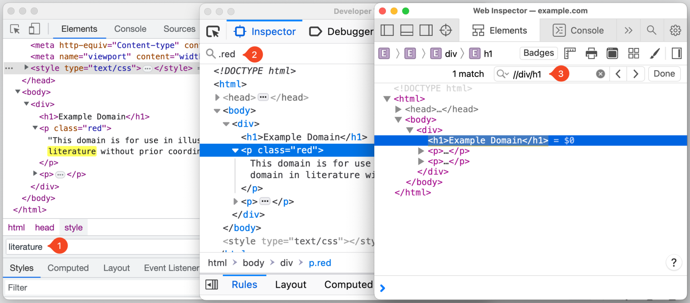

# Менее известные возможности инструментов разработки для различных браузеров

### Теги

браузер, инструменты разработчика  

### Автор

Jutsy

### Источники

[https://css-tricks.com/some-cross-browser-devtools-features-you-might-not-know/#aa-visualize-elements-with-badges](https://css-tricks.com/some-cross-browser-devtools-features-you-might-not-know/#aa-visualize-elements-with-badges)

### **Содержание**

Проведение поиска элементов в DOM-дереве

Управление узлами через консоль

Визуализация элементов с использованием значков

### Я провожу значительное количество времени, работая с инструментами разработчика, известными как DevTools, и я уверен, что многие из вас тоже. Я часто нахожусь в постоянном процессе переключения между различными DevTools, особенно когда сталкиваюсь с задачами, связанными с кросс-браузерностью, которые требуют проверки и устранения ошибок в разных браузерах.

DevTools, в большей степени, очень похожи на сами браузеры, в которых они используются. Например, не все функции DevTools в одном браузере будут идентичными или поддерживаться в DevTools другого браузера, что представляет собой еще одну сложность при работе с кросс-браузерностью.

Однако, существует достаточно большое количество функций DevTools, которые совместимы между различными браузерами. Среди них есть и некоторые менее известные функции, о которых я хотел бы поделиться с вами в этой статье.

Для того чтобы облегчить чтение и усилить акцент на совместимых функциях DevTools, я буду использовать слово «Chromium» для обозначения всех браузеров на базе Chromium, включая такие популярные браузеры, как Chrome, Edge и Opera. Большинство инструментов разработчика, встроенных в эти браузеры, предоставляют одни и те же функции и возможности, поэтому использование термина "Chromium" является моим способом краткого обозначения всех этих браузеров одновременно.

Если вы хотите получать еще больше такого контента, то переходите в наш телеграм канал, чтобы ничего не пропустить и первыми читать наши новости❤️🫶

## Проведение поиска элементов в DOM-дереве

Иногда дерево DOM так переполнено узлами, которые вложены в другие узлы, а те, в свою очередь, вложены в следующие узлы и так далее, что просматривать все это становится сложной задачей. Из-за этого иногда найти именно тот узел, который вам нужен, может быть довольно сложно. 

Но, к счастью, существуют инструменты, которые позволяют значительно ускорить процесс поиска в дереве DOM. Например, вы можете быстро выполнить поиск в дереве DOM, используя комбинацию клавиш **Cmd + F** (если вы используете операционную систему macOS) или **Ctrl+ F** (если ваша операционная система - Windows).

Однако это не единственный способ поиска. Вы также можете выполнять поиск, используя действительный селектор CSS. Например, если вы хотите найти все элементы с классом "red", вы можете ввести **.red** в поле поиска. Или вы можете использовать XPath для выполнения более сложных запросов. Например, **//div/h1** позволит вам найти все заголовки первого уровня, которые являются непосредственными потомками элементов div. Это делает поиск в дереве DOM гибким и мощным инструментом.

В браузерах, основанных на Chromium, фокус автоматически перемещается на узел, который соответствует критериям поиска по мере ввода текста. Это может стать причиной раздражения, особенно если вы работаете с более длинными поисковыми запросами или большим деревом DOM. Но, к счастью, существует возможность отключить данное поведение. Для этого вам необходимо перейти в раздел **«Настройки»** (нажмите F1), затем выберите **«Настройки»** → **«Глобальные»** → **«Поиск по мере ввода»** и наконец выберите **«Отключить»**.

После того как вы успешно нашли нужный узел в дереве DOM, есть возможность прокрутить страницу таким образом, чтобы этот узел оказался в поле зрения. Для этого вам потребуется щелкнуть правой кнопкой мыши по узлу и выбрать опцию «Прокрутить в поле зрения». Таким образом, узел станет видимым в области просмотра, что облегчит дальнейшую работу с ним.

## Управление узлами через консоль

DevTools предоставляет обширный набор инструментов, которые обеспечивают различные способы доступа к узлам DOM прямо из консоли. Это невероятно полезная функция, которая может значительно ускорить процесс отладки.

Один из примеров использования этой функциональности - применение **$0** для доступа к узлу, который был выбран в данный момент в дереве DOM. Это уникальное преимущество обеспечивает прямой доступ к любому узлу, который вы можете выбрать в дереве.

Браузеры на базе Chromium идут еще дальше, предлагая возможность доступа к узлам в обратном хронологическом порядке выбора. Это достигается с помощью команд **$1, $2, $3** и так далее, которые возвращают последние выбранные узлы.

Еще одной замечательной функцией, которую предлагают браузеры Chromium, является возможность копировать путь к узлу в формате JavaScript выражения, используя **document.querySelector**. Достаточно щелкнуть правой кнопкой мыши по узлу и выбрать **«Копировать»** → **«Копировать путь JS»**. Полученное выражение затем можно использовать для доступа к узлу прямо из консоли.

Наконец, DevTools предлагает еще один способ доступа к узлу DOM непосредственно из консоли: сохранение узла как временной переменной. Эта опция доступна при правом щелчке мыши по узлу и выборе соответствующего пункта меню. Однако, название этой опции может отличаться в разных браузерах:

- В **Chromium**: щелкните правой кнопкой мыши → «Сохранить как глобальную переменную».
- В **Firefox**: щелкните правой кнопкой мыши → «Использовать в консоли».
- В **Safari**: щелкните правой кнопкой мыши → «Элемент журнала».

## Визуализация элементов с использованием значков

DevTools обладает возможностью визуализации элементов, соответствующих определенным свойствам, и делает это путем отображения иконки рядом с узлом. Эти иконки являются кликабельными, и каждый браузер предоставляет свой набор уникальных иконок для различных свойств.
В браузере **Safari**, на панели инструментов панели «Элементы» вы найдете кнопку иконки, которую можно использовать для переключения видимости определенных иконок. Например, если к узлу применено объявление **CSS display: grid** или **display: inline-grid**, рядом с ним будет отображаться соответствующая иконка. 
При нажатии на иконку на странице будут выделены области сетки, размеры дорожек, номера строк и многое другое, что дает вам более глубокое понимание того, как работает данное свойство и как оно распределяет пространство на странице.

.webp)

В настоящий момент в инструментах разработчика Firefox, или DevTools, поддерживается ряд значков, полный список которых можно найти в исходной документации Firefox. Эти значки обеспечивают визуальные указатели для элементов веб-страницы. Например, значок "scroll" указывает на элемент, который можно прокрутить. Если вы нажмете на этот значок, будет выделен элемент, вызывающий переполнение. Рядом с ним будет отображаться значок "overflow", который указывает на то, что данный элемент содержит переполнение, которое может быть прокручено.

.webp)

В браузерах, основанных на **Chromium**, предоставляется возможность работать с узлами прямо из интерфейса браузера. Вы можете щелкнуть правой кнопкой мыши на любой узел и выбрать опцию **«Настройки значка…»,** что позволит вам открыть специальный контейнер. В этом контейнере перечислены все доступные значки, которые можно использовать для управления и настройки выбранного узла. Например, рядом с элементами **scroll-snap-type** будет располагаться специальный значок. Этот значок при нажатии активирует функцию наложения на соответствующий элемент. Этот процесс можно назвать процессом "scroll-snapscroll-snap".

Инструменты разработчика, доступные в современных браузерах, обладают гораздо более широким функционалом, чем может показаться на первый взгляд. В действительности, они способны предложить множество менее известных, но чрезвычайно полезных функций, которые могут значительно упростить и ускорить вашу работу, особенно при решении сложных и запутанных задач.
Независимо от того, работаете ли вы с большой структурой DOM или же пытаетесь визуализировать определенные элементы на веб-странице, эти функции могут оказаться невероятно полезными. Они могут значительно упростить процесс поиска и исправления ошибок, а также помогут вам лучше понять, как работает ваш код.
Таким образом, в следующий раз, когда вы будете работать с DevTools, не забудьте попробовать их. Возможно, вы обнаружите для себя что-то новое и полезное, что сделает вашу работу еще более продуктивной.