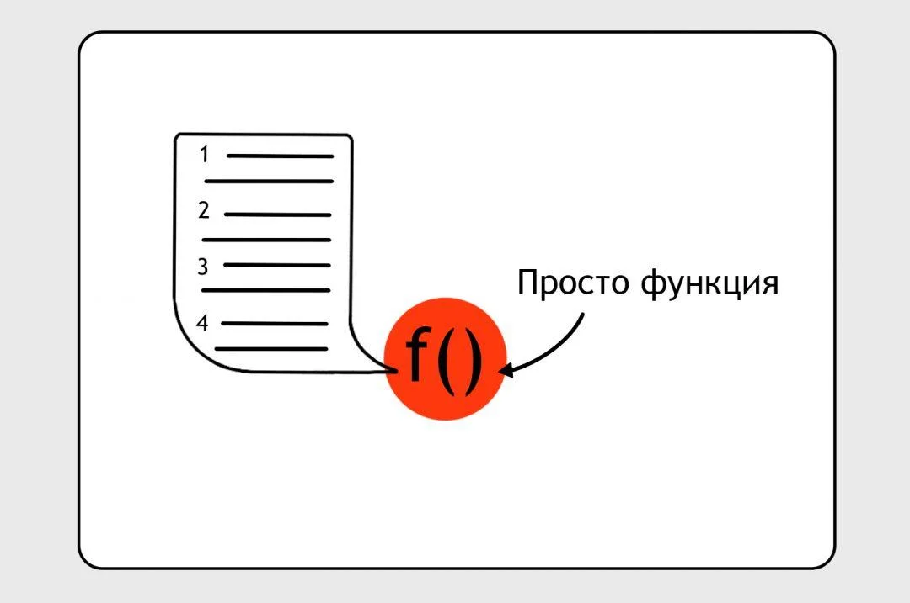

# Что такое ООП или Объектно-Ориентированное программирование?

### Теги

Языки Программирования, ООП

### Автор

Justy

### Источники

[https://thecode.media/objective/](https://thecode.media/objective/)

### Содержание

Обычное программирование

Что не так с обычным или процедурным программированием

Объектно-ориентированное программирование

### Сегодня нужно рассмотреть и изучать довольно серьёзную и сложную тему - объектно-ориентированного программирования, или, как его часто называют сокращенно, ООП. Это тема, обычно изучается на более продвинутом уровне разработки, ведь не каждый может сразу разобраться и понять её.

Сам термин "объектно-ориентированное программирование" намекает на то, что в рамках этого подхода основное внимание уделяется объектам. Однако, на практике, все оказывается не так просто, как может показаться на первый взгляд, и детали этого подхода будут обсуждаться позже. Сейчас давайте поговорим о самом ООП в общих чертах и попробуем разобраться, с чего начинается введение в эту уникальную и мощную парадигму программирования.

Если вы хотите получать еще больше такого контента, то переходите в наш телеграм канал, чтобы ничего не пропустить и первыми читать наши новости❤️🫶

## **Обычное программирование**

В большинстве случаев, когда говорят об "обычном программировании", они подразумевают процедурное программирование, основными элементами которого являются процедуры и функции. Функция в программировании - это своего рода мини-программа, которая получает на вход определенные данные, обрабатывает их внутри себя и, в результате своих вычислений, может возвращать обработанные данные. 

> Это можно представить как конвейер, упакованный в коробку. На этом конвейере проходят все ваши данные, которые затем обрабатываются и возвращаются вам в обработанном виде. Это ключевой элемент любой программы, который позволяет обработать и преобразовать входные данные в нужные вам результаты
> 

Например, в интернет-магазине может быть реализована функция под названием «Проверить email». Эта функция представляет собой набор определенных операций, выполняемых над входными данными. В данном случае на вход функции подается текст, который предположительно представляет собой адрес электронной почты. 

Далее этот текст сопоставляется с набором правил, которые определяют, что считать правильным адресом электронной почты. После этого функция выдает ответ, который представляет собой логическую переменную: если адрес является правильным, то выводится значение **true**, если адрес не соответствует правилам, то выводится значение **false**.

.webp)

> Функции оказываются крайне полезными, когда перед вами стоит задача упаковать большое количество команд в одну единственную.
> 

Допустим, вы хотите проверить электронный адрес. Это может быть простой проверкой на соответствие регулярному выражению. Но в других сценариях, проверка может быть гораздо более сложной и включать в себя целый ряд операций: запросы в словари, проверка по базам данных спамеров, и даже сопоставление с уже известными электронными адресами. 

Функции позволяют вам упаковать любую комбинацию из этих действий в одну единицу, которую затем можно вызвать одним движением. Таким образом, функции представляют собой мощный инструмент для оптимизации и упрощения вашего кода.

## Что не так с обычным или процедурным программированием?

Процедурное программирование идеально подходит для использования в относительно простых программах, где все задачи можно решить, грубо говоря, с использованием всего лишь десятка функций. Эти функции аккуратно вложены друг в друга, взаимодействуют друг с другом, и благодаря этому можно передать данные из одной функции в другую, создавая целостную систему.

Возьмем за пример ситуацию, когда вы пишете функцию под названием "Зарегистрировать пользователя интернет-магазина". В рамках этой функции вам нужно проверить электронный адрес пользователя. Именно здесь вы вызываете другую функцию, которая называется "Проверить email". Эта функция выполняется внутри функции "Зарегистрировать пользователя", и в зависимости от ответа, который вы получаете от функции "Проверить email", вы либо продолжаете регистрацию пользователя, либо выводите сообщение об ошибке.

Может быть так, что эта функция будет использоваться еще в десятке различных мест. Таким образом, функции взаимодействуют и как бы переплетаются друг с другом, создавая сложную и функциональную систему.

.webp)

В один прекрасный день, продакт-менеджер приходит к вам и говорит: «Мне очень хочется, чтобы наш пользователь всегда точно понимал, какая именно ошибка возникла при вводе его электронного адреса». 

> Ваша задача теперь - не просто научить функцию определять правильность ввода электронного адреса, выдавая true или false, но и указывать конкретный код ошибки
> 

Например, если в адресе обнаружена опечатка, то функция должна выдать код 01. Если адрес относится к известным спамерам, то код будет 02, и так далее. Задача на первый взгляд кажется несложной и вы приступаете к ее решению. Вы начинаете вникать в детали функции, разбираться в ее механизме действия и в ходе этого процесса меняете ее поведение. Теперь функция при обнаружении ошибки выдает не просто true или false, а конкретный код ошибки. Если же все в порядке, то функция пишет "ОК"

Именно в этот момент вы обнаруживаете, что ваш код перестает работать корректно. Все десять мест в программе, которые рассчитывали на получение от функции проверки значения true или false, теперь получают «ОК». И это приводит к тому, что код начинает работать некорректно и ломается

.webp)

Теперь перед вами стоит выбор:

- Переписывать все функции с нуля, чтобы они могли понимать новые ответы проверяльщика адресов. Это потребует изучения каждой функции и ее изменения так, чтобы она могла адекватно реагировать на новые ответы
- Изменить сам проверяльщик адресов, чтобы он остался совместимым со старыми местами. В этом случае, вам придется найти способ внедрения новых кодов ошибок в нужном вам месте, сохраняя при этом обратную совместимость
- А также написать новый проверяльщик, который будет выдавать коды ошибок. Этот вариант предполагает использование старого проверяльщика в старых местах и создание нового для новых задач

Эта задача, безусловно, решаема за час или два. Однако представьте, что у вас есть сотни таких функций, и вам нужно вносить в них изменения десятками раз в день. Каждое изменение, как правило, усложняет поведение функции и делает ее результат более сложным. 

Кроме того, каждое изменение в одном месте может сломать что-то в трех других местах. В итоге вы окажетесь с десятками клонированных функций, которые сначала вам придется изучить, а затем и вовсе забыть.

Это явление называется "спагетти-кодом", и для борьбы с ним было придумано объектно-ориентированное программирование. Этот подход позволяет структурировать код, делая его более понятным и удобным для внесения изменений.

## **Объектно-ориентированное программирование**

Основная задача объектно-ориентированного программирования (ООП), которое является одним из самых популярных и широко используемых подходов в современной разработке программного обеспечения, заключается в упрощении сложного кода. Эта задача достигается путем разделения программы на отдельные независимые блоки, которые мы называем объектами

В контексте ООП, понятие "объект" не должно восприниматься как что-то абстрактное или непостижимое. Объект в ООП - это просто совокупность данных и функций, которые используются в традиционном функциональном программировании. Проще говоря, можно представить, что вы взяли кусок кода, упаковали его в коробку и закрыли крышку. Таким образом, эта коробка с крышкой, содержащая в себе код, и является объектом

Однако, главная особенность объектов в ООП, которая отличает их от простого куска кода, заключается в их способности взаимодействовать друг с другом. Объекты могут обмениваться данными и вызывать функции друг друга, что позволяет легко модифицировать и расширять программу, добавляя новые объекты и функции, без нарушения работы уже существующего кода. Это облегчает процесс разработки и поддержки программ, делая его более гибким и эффективным

.webp)

Программисты во всем мире пришли к общему соглашению о терминологии - данные внутри объекта называются свойствами, а функции принято называть методами. Несмотря на то, что это просто слова, по сути данные и функции остаются теми же переменными и функциями, что мы все знаем и любим.

Объект можно представить себе как независимый электроприбор, который у вас на кухне. Например, чайник, который кипятит воду, или плита, которая греет, блендер, который взбивает, а мясорубка делает фарш. Внутри каждого из этих устройств есть множество компонентов: моторы, контроллеры, кнопки, пружины, предохранители — но при использовании эти детали не беспокоят вас. Вы просто нажимаете кнопки на панели каждого прибора и он выполняет свою функцию, то, что от него ожидается. Благодаря совместной работе всех этих приборов вы получаете готовый ужин.

Объекты в программировании характеризуются четырьмя ключевыми словами: инкапсуляция, абстракция, наследование и полиморфизм. Эти термины важны в понимании объектно-ориентированного программирования. Если вам интересно узнать более подробно о том, что каждое из этих слов означает и как они применяются в программировании, я приглашаю вас прочитать следующий раздел.

### Что такое инкапсуляция?

> Инкапсуляция – это ключевое понятие, которое означает, что каждый объект является независимым. Это означает, что каждый объект устроен таким образом, что все необходимые для его функционирования данные находятся внутри этого объекта, а не расположены где-то снаружи в программе. Возьмем, к примеру, объект "Пользователь".
> 

В нем будут храниться все данные об этом пользователе: его имя, адрес, и так далее. Вместе с этим, в объекте будут содержаться и методы, связанные с этим пользователем. 

Они могут включать в себя, например, метод "Проверить адрес", который проверяет правильность введенного адреса, или метод "Подписать на рассылку", который позволит пользователю подписаться на интересующие его новостные обновления. Это означает, что все, что связано с пользователем, находится в одном месте, что облегчает управление данными и их использование.

### Что такое **Абстракция**?

> Абстракция - это принцип, согласно которому у объекта есть "интерфейс": у каждого объекта есть определенный набор методов и свойств, к которым мы можем обратиться извне этого объекта.
> 

Это можно сравнить с использованием бытового прибора, например, блендера. Внутри блендера находится множество механизмов и деталей, каждая из которых выполняет свою функцию, чтобы обеспечить его работу. Однако для нас, пользователей, все это скрыто. Мы видим только внешнюю панель управления с кнопками. Вот эта панель и является абстрактным интерфейсом блендера. Все сложные процессы и детали работы устройства скрыты от нас, а мы можем управлять блендером, лишь нажимая на кнопки его интерфейса. Таким образом, принцип абстракции делает использование объектов более простым и понятным.