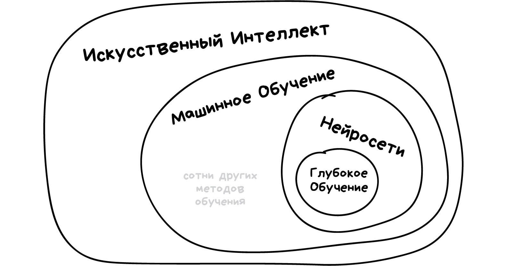

# Что такое искусственный интеллект и как он работает?

### Теги

AI, Нейросети

### Автор

Jutsy

### Источники

[https://blog.skillfactory.ru/iskusstvennyj-intellekt/](https://blog.skillfactory.ru/iskusstvennyj-intellekt/)

### Содержание

Как работает искусственный интеллект

Искусственный интеллект и нейросети — это одно и тоже?

Где возможно применение ИИ? 

### Искусственный интеллект, часто упоминаемый просто как AI, является уникальным и захватывающим разделом компьютерных наук. Его основная цель заключается в создании машин или программ, которые могут имитировать человеческий разум, учиться и думать самостоятельно. Это область, которая вызывает интерес и вопросы о том, как работает эта технология, какие изменения она привносит в наш мир, и где она сегодня активно используется.

На сегодняшний день, нашу повседневную жизнь без искусственного интеллекта уже сложно представить. Он буквально присутствует повсеместно, влияет на самые разные аспекты нашей жизни и большинство людей хотя бы раз использовали ИИ для решения своих проблем или прибегали к его помощи.

Так что же такое искусственный интеллект, каковы его основные принципы работы, где его можно использовать и какие перспективы он открывает перед нами? Это вопросы, которые стоят перед нами, и давайте попробуем разобраться в этом вопросе, чтобы понять, как ИИ может помочь нам в будущем.

Если вы хотите получать еще больше такого контента, то переходите в наш телеграм канал, чтобы ничего не пропустить и первыми читать наши новости❤️🫶

## Как работает искусственный интеллект

Искусственный интеллект в своем развитии похож на маленького ребенка. Как и ребенок, он впитывает в себя всю информацию, которую предоставляют ему люди, и затем научившись ее использовать, применяет при решении различных задач. Он может выполнять такие операции, как решение примеров, создание текстов и даже рисование изображений.

Процесс работы искусственного интеллекта подразумевает выполнение нескольких ключевых этапов:

- Сбор необходимых данных. Для успешного обучения AI требуется большой объем информации, которую он может получить из множества различных источников, будь то базы данных, интернет, датчики или другие ресурсы.
- Подготовка данных. На этом этапе искусственный интеллект обрабатывает собранную информацию, адаптируя ее для последующего использования в своей работе.
- Обучение моделей. Искусственный интеллект использует данные для обучения выполнению конкретных задач. Это может быть распознавание определенных паттернов, прогнозирование будущих событий и т.д. В процессе обучения программа анализирует данные и находит в них закономерности.
- Тестирование и оптимизация. После того как обучение завершено, модель подвергается тестированию на новых данных, чтобы оценить ее эффективность и точность. В случае необходимости, алгоритмы могут быть дополнительно настроены и улучшены для повышения их производительности.
- Работа в реальном времени. Когда модель успешно прошла все предыдущие этапы и была оптимизирована, она готова к использованию в реальных условиях. Теперь она может выполнять различные функции, такие как классификация данных или принятие решений, основанных на анализе данных.

Сегодня давайте более подробно разберем принципы работы ИИ на примере всем известного ChatGPT. В начале процесса обучения ИИ использовали огромный массив текстовых данных, которые были собраны из различных источников в интернете, включая веб-сайты, электронные книги, словари и энциклопедии, аналогичные "Википедии". За время обучения модель изучила и запомнила языковые закономерности, структуру предложений, грамматику и даже собрала обширную базу знаний.

После этого модель подверглась дополнительному обучению на специфических задачах, таких как генерация ответов на поставленные вопросы, перевод текста из одного языка на другой и суммирование ответов. Все это помогло модели лучше справляться с конкретными запросами и улучшить качество предоставляемых ответов.

Когда пользователь задает вопрос или дает команду, ChatGPT генерирует ответ, опираясь на выученные ранее паттерны. Модель тщательно анализирует введенный пользователем текст, определяет контекст и генерирует наиболее подходящий ответ. Полученные в ходе взаимодействий с пользователями данные используются для дальнейшего обучения и оптимизации модели.

Возьмем для примера ситуацию, когда мы просим нейросеть написать текст про устройство космического корабля. Она генерирует результат, после чего мы даем новую команду: "Нужно обязательно добавить информацию из книги N, сократить текст до пяти абзацев и сделать так, чтобы каждое предложение начиналось с новой буквы алфавита". После получения этой команды, ChatGPT берет за основу уже созданный текст и перерабатывает его, учитывая новые требования.

## Искусственный интеллект и нейросети — это одно и тоже?

Нейросеть представляет собой один из многочисленных подходов, которые используются в области искусственного интеллекта. Это сложная система, которая имитирует работу человеческого мозга для решения различных задач. Однако важно понимать, что, несмотря на то, что нейросети являются важной частью искусственного интеллекта, они не являются его полным синонимом. Искусственный интеллект включает в себя гораздо больше подходов и технологий, чем только нейросети.

Давайте разберемся поподробнее. Искусственный интеллект — это обширная технологическая область, цель которой — научить машины и компьютеры выполнять задачи, которые обычно требуют человеческого вмешательства, например, понимать естественный язык, распознавать графические образы или принимать сложные решения.

> Нейросети — это лишь одна из технологий, используемых в ИИ. Они имитируют работу человеческого мозга, обучаясь на основе данных и распознавая образы. Это позволяет им выполнять специфические задачи, такие как распознавание речи или изображений.
> 

 В конечном итоге, нейросети — это лишь инструмент, используемый в рамках более широкого поля искусственного интеллекта.

## Где возможно применение ИИ?

### Искусственный интеллект в медицине

Искусственный интеллект (ИИ), который широко применяется в современном мире, играет важную роль в области анализа медицинских изображений, таких как рентгеновские снимки. В настоящее время особенно активно развивается направление применения ИИ для диагностики и оценки риска развития онкологических заболеваний. Крупные компании, такие как Philips Healthcare, SIEMENS Healthineers и Google AI Healthcare, представляют свои собственные инновационные разработки в этой важнейшей сфере.

В медицинской сфере искусственный интеллект выступает в роли цифрового ассистента врача, способного анализировать все мельчайшие детали, ускоряя работу и предоставляя альтернативное экспертное мнение. Такой ИИ способен очень быстро и точно анализировать сотни рентгеновских и МРТ-снимков, выявляя те случаи, которые требуют более детального и тщательного внимания со стороны квалифицированных медицинских специалистов.

Искусственный интеллект также анализирует генетическую информацию пациентов, чтобы предложить наиболее эффективные индивидуализированные планы лечения. Это особенно важно в онкологии, где лечение может быть адаптировано под конкретные генетические мутации опухоли, что значительно повышает шансы на успешное излечение. ИИ-помощники обеспечивают первичную медицинскую консультацию, анализируя симптомы пациента и предоставляя рекомендации о необходимости обращения к специалисту, что значительно упрощает и ускоряет процесс получения медицинской помощи.

### Искусственный интеллект **в банкинге**

Искусственный интеллект находит все больше применения в различных отраслях, включая борьбу с мошенническими операциями. Современные ИИ-инструменты способны анализировать образцы транзакций клиентов, при этом они обучаются на основе известных случаев мошенничества. Это позволяет ИИ выявлять необычные или подозрительные действия, которые могут указывать на мошенническую деятельность, и эффективно предотвращать подобные ситуации в будущем.

Кроме того, искусственный интеллект способен анализировать финансовую историю клиента, его текущее финансовое состояние и на основе этих данных давать рекомендации банку по выдаче кредита. Это помогает банкам принимать более обоснованные решения и уменьшать риски.

Также ИИ может стать незаменимым помощником в управлении личными финансами. Он способен анализировать расходы клиентов, выявлять лишние траты и предлагать эффективные способы экономии. Это помогает людям контролировать свои финансы, планировать бюджет и делать более обдуманные траты.

### Искусственный интеллект **в искусстве**

Искусственный интеллект (ИИ) продолжает проникать в мир музыки и кино, внося революционные инновации и открывая широкий спектр новых возможностей для творческого процесса и производства контента.

В музыкальной сфере, ИИ способен генерировать мелодии, используя алгоритмы глубокого обучения, которые обучаются на основе анализа огромных массивов музыкальных данных. Этот процесс позволяет ИИ создавать новые и уникальные музыкальные композиции. Интересно, что ИИ способен создавать музыку в самых разнообразных стилях, от классической музыки до современной популярной музыки.

В мире кино, ИИ используется в качестве помощника при написании сценариев, предлагая оригинальные идеи для сюжетных поворотов или диалогов. Это дает возможность создавать более интересные и запоминающиеся сценарии. Кроме того, ИИ используется для создания реалистичных CGI-персонажей и сцен с визуальными эффектами, что позволяет улучшить визуальное восприятие фильмов и делает их более привлекательными для зрителей.

### Искусственный интеллект **в быту**

Сегодня в домах многих людей можно увидеть умную колонку, устройство, которое не только воспроизводит музыку на ваш выбор, но и ведет активный диалог с пользователями, отвечая на вопросы и выполняя различные команды.

Эти умные колонки работают с использованием последних достижений в области технологий распознавания речи и обработки естественного языка. Это позволяет им не только понимать и обрабатывать запросы пользователя, но и делать это с высокой степенью точности и эффективности.

При помощи встроенного голосового помощника мы можем управлять различными умными устройствами в доме, такими как освещение, бытовая техника, телевизор и даже система безопасности. Это революционный шаг в области домашней автоматизации, который открывает новые возможности для удобства и комфорта.

В ближайшем будущем, искусственный интеллект будет играть еще большую роль в управлении умными домами. Расширенные функции будут включать автоматический заказ продуктов, составление графика уборки, включение света в определенное утреннее время и даже предоставление актуальной информации о погоде за окном. Это только начало того, что технологии искусственного интеллекта могут предложить для улучшения нашего быта.