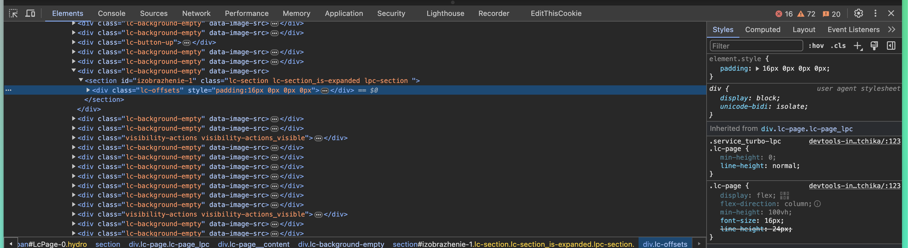
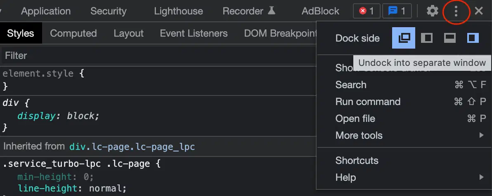
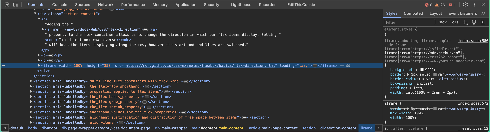
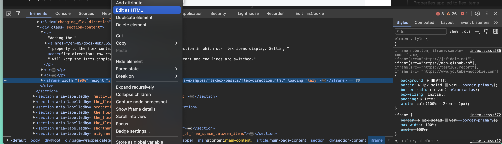
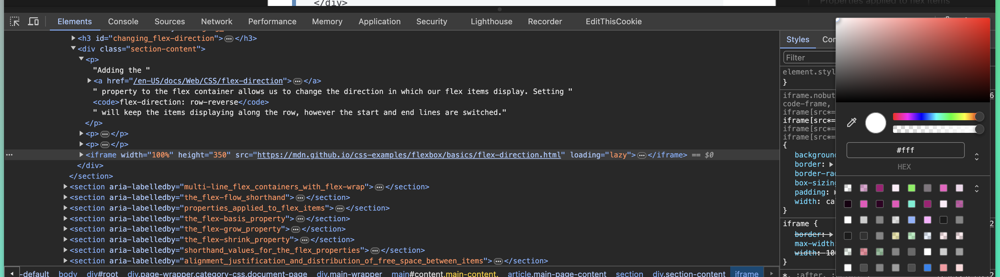
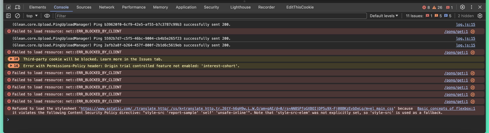
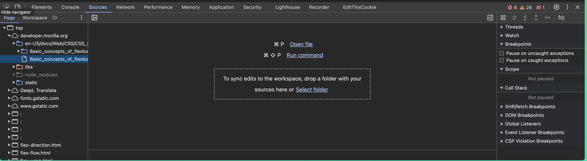
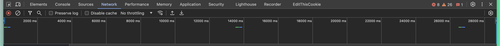
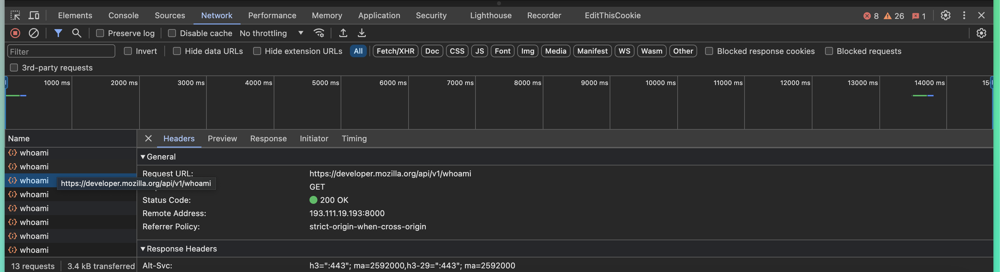

# DevTools что это и зачем это нужно?

### Теги

браузер, инструменты разработчика 

### Автор

Justy

### Источники

[https://practicum.yandex.ru/blog/devtools-instrumenty-razrabotchika/](https://practicum.yandex.ru/blog/devtools-instrumenty-razrabotchika/)

### **Содержание**

Что такое DevTools?

Где их найти в браузере?

Какие возможности у DevTools?

### Если вы хотите получать еще больше такого контента, то переходите в наш телеграм канал, чтобы ничего не пропустить и первыми читать наши новости❤️🫶

## Что такое DevTools?

DevTools (от англ. Development tools) — это функциональные инструменты, интегрированные непосредственно в браузер, которые играют важную роль в процессе разработки веб-сайтов. Они предоставляют разработчикам возможность быстро и эффективно редактировать, тестировать и диагностировать проблемы, которые могут возникнуть в процессе работы сайта. 

Эти инструменты способны значительно упростить и ускорить процесс разработки, устраняя необходимость во многих дополнительных приложениях. В этой статье мы подробно рассмотрим, из чего состоят и какую пользу могут принести инструменты разработки (девтулзы) браузера Google Chrome. 

Отметим, что в других браузерах названия, функциональность и внешний вид этих инструментов могут несколько отличаться, поэтому мы сосредоточимся на версии для Chrome.

Такие инструменты, как эти, необходимы для различных профессионалов в области веб-разработки, и вот почему:

- **Верстальщику:** эти инструменты позволяют писать и исправлять разметку и стили непосредственно в браузере, что облегчает процесс подбора параметров анимации и вносит удобство в рабочий процесс.
- **Разработчику:** они предлагают возможность набрасывать прототипы кода и изучать его поведение в режиме реального времени. Это помогает воспроизводить и исправлять ошибки, а также оптимизировать приложение, делая его более эффективным и надежным.
- **Тестировщику:** эти инструменты позволяют проверять работу приложения, эмулировать или воссоздавать различные условия, устройства и браузеры. Это обеспечивает более тщательное тестирование и помогает обнаружить и исправить любые неполадки или проблемы.

## Где их найти в браузере?

Для того чтобы открыть инструменты разработчика или DevTools, вам потребуется вызвать контекстное меню. В контекстном меню присутствует один из следующих пунктов:

- «Исследовать элемент», что позволяет исследовать конкретные части веб-страницы;
- «Проверить объект», что используется для анализа определенных объектов на странице;
- «Просмотреть код», что дает возможность взглянуть на код, составляющий страницу;
- "Inspect", англоязычное обозначение для механизма проверки элементов страницы.

Если вы предпочитаете использовать горячие клавиши, вот они:

- **Cmd+Alt+I** для пользователей на macOS;
- **F12** для тех, кто использует Windows;
- **Ctrl+Alt+I** для пользователей Linux.

Инструменты разработчика занимают достаточно много пространства на экране, поэтому перед началом работы вам, возможно, придется решить, в какой части экрана его будет удобнее закрепить. Это может варьироваться в зависимости от браузера:

- **Google Chrome и Firefox** предоставляют возможность закрепить DevTools снизу, справа, слева или вынести его в отдельное окно для удобства;
- **Microsoft Edge** позволяет закрепить его только отдельно или снизу экрана;
- **Safari** дает возможность закрепить его снизу, справа или открыть в отдельном окно для большего удобства.

Разработчики регулярно пользуются инструментами разработки, известными как DevTools, которые являются неотъемлемой частью их работы. Эти инструменты, а также многие другие навыки, можно освоить на обучающем курсе под названием "Фронтенд-разработчик". Во время этого курса студенты не только верстают разметку и настраивают стили, но и осваивают различные языки программирования. Они учатся работать с макетами, создавать интерфейсы и многое другое.

Весь этот процесс обучения проходит под пристальным вниманием команды ревьюеров, кураторов и наставников, которые поддерживают студентов на каждом этапе их обучения. Их поддержка и руководство помогают студентам лучше усвоить материал и подготовиться к работе в новой специальности, что является ключевой целью курса.

## Какие возможности у DevTools?

DevTools интерфейс, который представлен в виде набора вкладок-панелей, может показаться несколько подавляющим при первом взгляде, ведь кажется, что их слишком много. Однако, безусловно, стоит потратить немного времени на знакомство с основными элементами этой консоли разработчика. Это инвестиция, которая в долгосрочной перспективе позволит вам разрабатывать и отлаживать ваши сайты гораздо быстрее и эффективнее. Теперь давайте рассмотрим каждый из этих ключевых элементов подробнее:

### Elements

Самая первая и часто используемая панель, которую вы видите, называется Elements. Это место, где вы можете просмотреть текущее дерево элементов, которое представляет собой HTML-документ, отображаемый в виде дерева тегов. Здесь вы также можете увидеть стили, примененные к этим тегам, обработчики событий, которые связаны с ними, а также свойства, которые установлены для каждого отдельного элемента.

**Разметка —** Если вы хотите отредактировать любой элемент на странице, открытой в вашем веб-браузере, все, что вам нужно сделать, это кликнуть по нему правой кнопкой мыши и выбрать пункт Edit as HTML (редактировать как HTML). Это особенно удобно, когда вам необходимо проверить компонент на переполнение, применить или убрать какой-нибудь CSS-класс для того, чтобы увидеть, как это повлияет на общий вид страницы.

**CSS —** важная информация о стилях, которую можно найти в консоли разработчика, располагается на вкладке Styles. Эта вкладка предоставляет возможность отключать и редактировать любые CSS-правила, что делает ее неотъемлемым инструментом для веб-разработчиков. Кроме того, для некоторых свойств предусмотрены специальные помощники. 

Например, при изменении цвета будет отображаться палитра уже используемых на сайте цветов и инструмент для выбора цвета, или пипетка. Эта вкладка является, возможно, самой популярной среди разработчиков, поскольку она помогает в проектировании раскладки и внешнего вида элементов. После завершения дизайна, все изменения и коррективы легко перенести прямо в код

Панель **Elements** в Google Chrome DevTools предлагает три удобных и эффективных способа получить детальную информацию о любом элементе на веб-странице, что делает процесс отладки намного проще:

- **Через инспектор —** этот способ идеально подходит, даже если DevTools пока ещё не открыт, но элемент, который вам нужен, хорошо видно на странице. Просто кликните по нему правой кнопкой мыши, и появится контекстное меню. В этом меню выберите Inspect или «Просмотреть код», и DevTools автоматически переключится на панель Elements и выделит этот элемент в DOM Tree
- **Поиск по элементам —** когда инструменты разработчика уже открыты и вы хотите найти конкретный элемент, достаточно нажать Ctrl+F/Cmd+F. После этого под разметкой внизу появится окно поиска. Здесь вы можете искать по тегу, атрибуту, классу или текстовому содержимому элемента. Этот способ особенно полезен, когда вы ищете определенный элемент в большом DOM Tree
- **Указка, или прицел —** cпециальная кнопка в левом верхнем углу DevTools позволяет войти в режим выбора элемента. В этом режиме вы можете водить курсором по странице в поисках нужного элемента и кликать по нему, чтобы обнаружить соответствующий ему кусочек кода в разметке. Этот способ очень удобен, когда элемент сложно найти вручную в DOM Tree

### **Console**

В панель Console браузеры выводят различные ошибки и предупреждения, которые могут возникнуть в процессе работы веб-страницы. Это включает, но не ограничивается, ситуациями, когда на странице не загружаются шрифты, изображения или стили. В таких случаях здесь появятся сообщения, которые предоставят подробное описание проблемы, позволяя разработчикам быстро и эффективно найти и устранить источник проблемы

Консоль разработчика предоставляет уникальную возможность исполнения кода для тщательного тестирования и отладки веб-страницы. Это инструмент, который позволяет разработчику открывать страницу прямо в браузере и написать код непосредственно там, в реальном времени. Если разработчик вводит команду на языке JavaScript, она мгновенно выполняется. Это означает, что код будет взаимодействовать с разметкой страницы, позволяя разработчику видеть влияние своего кода на страницу в реальном времени.

### **Sources**

Во вкладке "Sources" отображаются все файлы, которые были загружены из различных источников и к которым сайт обращался в разное время. Эта функция часто используется разработчиками при отладке кода, поскольку она позволяет увидеть полный список всех файлов, изучить их содержимое и установить точки останова (breakpoints) в нужных местах. Это дает возможность просмотреть значения интересующих вас переменных в любой момент времени. Кроме того, если вы получите доступ к локальным файлам через "Workspaces", вкладка "Sources" может быть использована в качестве полноценного редактора кода, что делает ее удобной и практичной для разработчиков.

### **Network**

Вкладка "Network" предоставляет обширную информацию о том, сколько времени заняла загрузка страницы, какие ресурсы были успешно подключены, а какие не смогли подключиться. С её помощью можно провести детальный анализ процесса загрузки страницы, что особенно важно при оптимизации скорости загрузки. Вдобавок, она позволяет мониторить выполняемые запросы в реальном времени, что помогает отслеживать их работу. Однако стоит отметить, что при первом открытии вкладка может быть пустой. В этом случае, необходимо просто перезагрузить страницу для получения актуальной информации.

Если вы нажмете кнопку фильтрации, вы сможете наблюдать процесс загрузки определенных видов ресурсов. Это может включать в себя различные элементы, такие как изображения, используемые в контенте, шрифты, выбранные для обеспечения читаемости и эстетики текста, или заголовки, которые помогают организовать и структурировать информацию. Эта функция особенно полезна для разработчиков и дизайнеров, которые хотят понять, как именно загружаются и отображаются их ресурсы на веб-странице.

В этой статье мы коснулись лишь четырех панелей, но на самом деле в инструментах разработчика DevTools их гораздо больше, а их функциональность намного шире, чем здесь описано. 

Один из важнейших навыков, которым обязательно должен владеть каждый разработчик, — это умение работать с документацией и эффективно использовать её для своих нужд. 

Для более глубокого погружения в возможности этого мощного инструмента, настоятельно рекомендуем вам изучить официальную документацию по Chrome DevTools, предоставленную самим Google. Это позволит вам открыть для себя новые возможности и улучшить свои навыки работы с инструментами разработки.