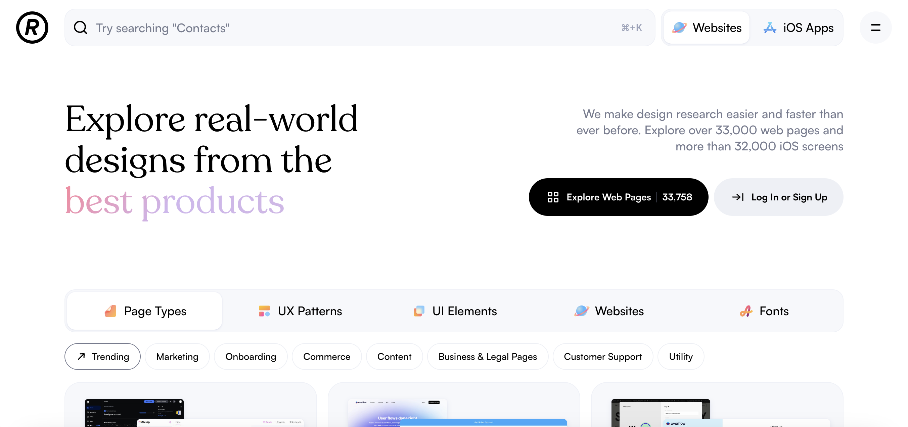
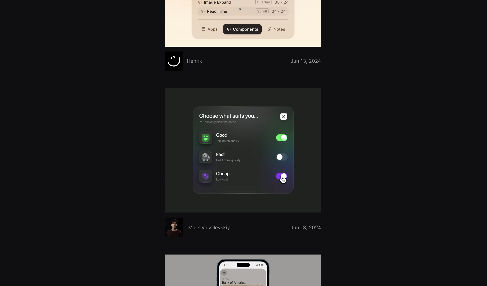
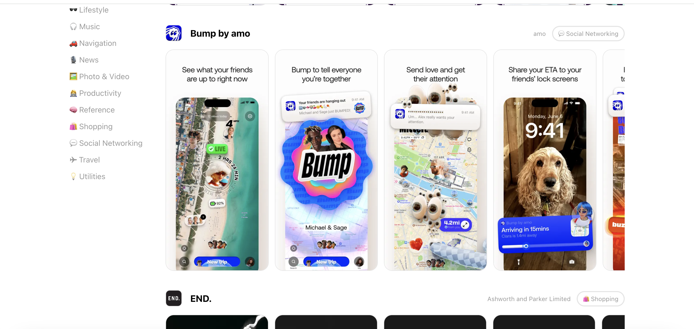
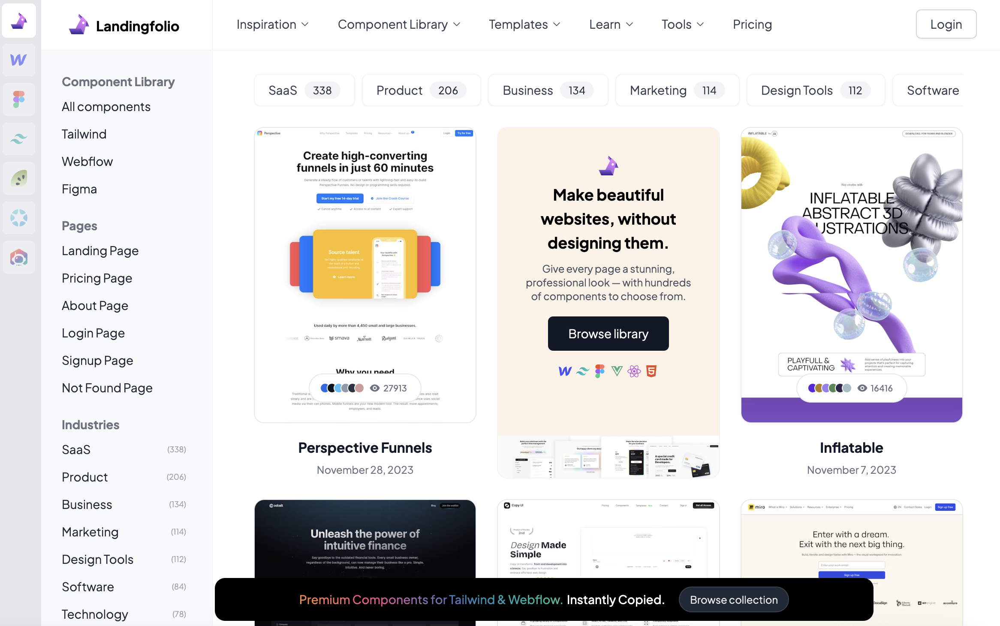
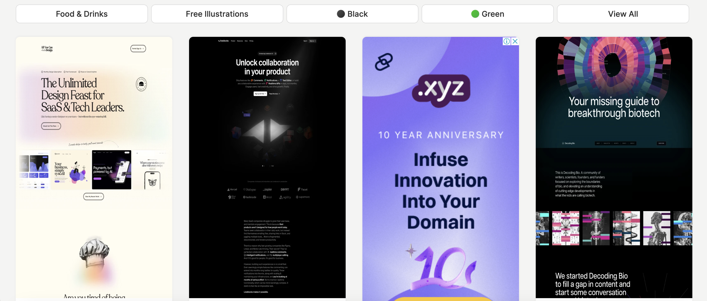
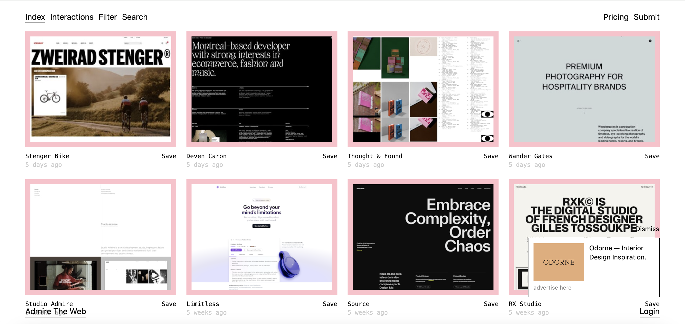
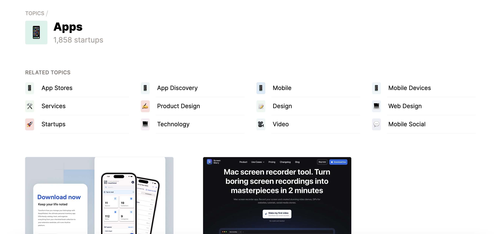
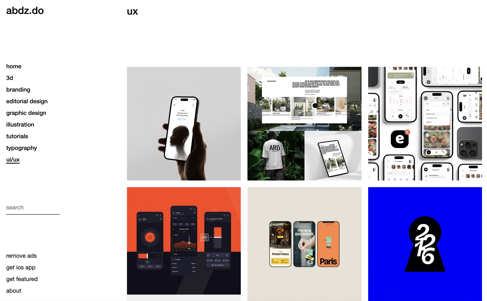
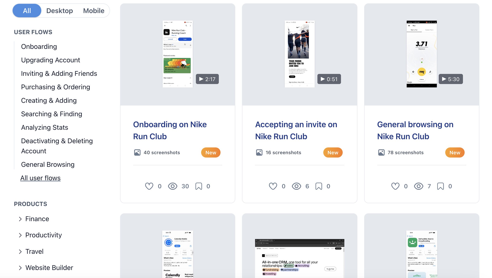
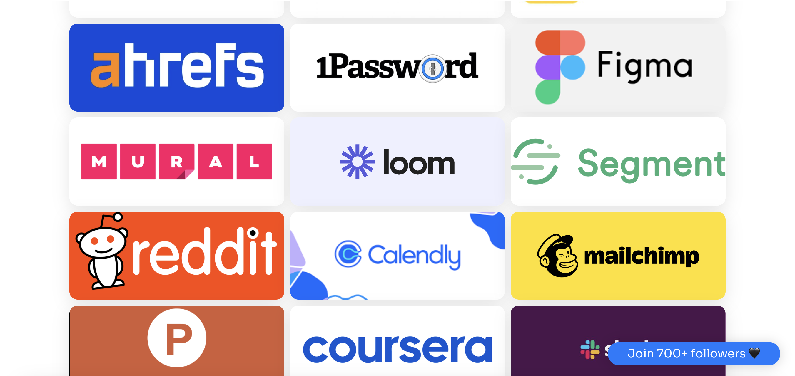

# Где искать вдохновение UI/UX дизайнерам. Подборка 1

### **Теги**

насмотренность, UI/UX

### **Автор**

Justy

### **Содержание**

Layers

Refero

uibits.co

Design Systems Surf

scrshts

Landingfolio

Lapa ninja 

Admire the web

Beta list

abduzeedo

Page flows 

Marbleflows

### Обходили весь интернет и собрали лучшие сайты для продуктовых дизайнеров😇

### Мы часто ходим по интернету и собираем полезности, поэтому переходите в наш [телеграм канал](https://t.me/justynews), чтобы ничего не пропустить и первыми читать наши новости❤️🫶

## [Layers](https://layers.to/)

Layers — это платформа, на которой дизайнеры могут делиться своими работами, общаться с другими и расширять свое портфолио. В Layers дизайнеры могут делиться своими работами, иметь собственный профиль портфолио с контактной информацией для прямого найма.

## [**Refero**](https://refero.design/)

Изучите реальные проекты продуктов. Вдохновляйтесь лучшими примерами продуктового дизайна. Наши дизайнерские исследования выполняются легко и быстро. Исследуйте более 21 000 страниц и более 20 000 экранов iOS.

## [**uibits.co**](https://uibits.co/)

Добро пожаловать на [UIBits.co](http://uibits.co/), идеальное место для поиска вдохновения в высококачественном дизайне пользовательского интерфейса. Изучите нашу обширную библиотеку, наполненную тщательно продуманными дизайнами пользовательского интерфейса, которые разбудят ваш творческий потенциал и улучшат ваши проекты.

## [**Design Systems Surf**](https://designsystems.surf/)

Design Systems Surf — это база данных лучших в своем классе систем дизайна, организованная и отсортированная по компонентам и каталогам.

## [scrshts](https://scrnshts.club/)

Подборка скриншотов приложений из разных категорий  

## [Landingfolio](https://www.landingfolio.com/)

Лендинги, страницы прайса, о проекте и многое другое 

## [Lapa ninja](https://www.lapa.ninja/)

Сайт, ссылки на которой мы так часто видим на пинтересте 

## [Admire the web](https://admiretheweb.com/)

Сайты с эстетикой 

## [Beta list](https://betalist.com/topics/apps)

Сайт, на котором можно посмотреть, какие ИИ приложения сейчас в тренде, найти вдохновение по приложениям, вебу, рекламе, 3д и много чему еще 

## [abduzeedo](https://abduzeedo.com/tags/ux)

UI/UX, графический дизайн, брендинг

## [Page flows](https://pageflows.com/)

Юзер флоу, которые точно вдохновят вас 

LaudableApps

LaudableApps — это независимая выставка красивых приложений для iOS, созданная и поддерживаемая Тобиасом Райхом в качестве проекта для свободного времени.

## [Marbleflows](https://www.marbleflows.com/onboarding)

Сайт, на котором можно посмотреть флоу самых известных платформ