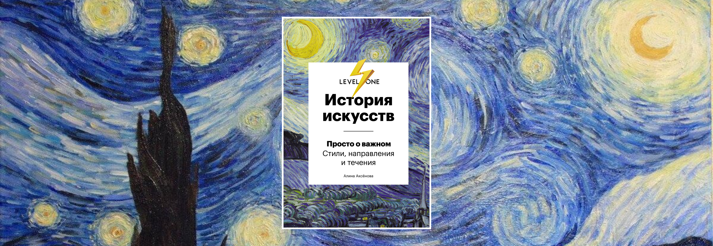
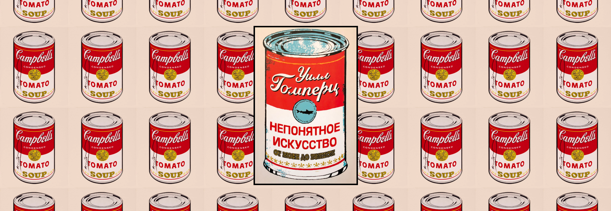
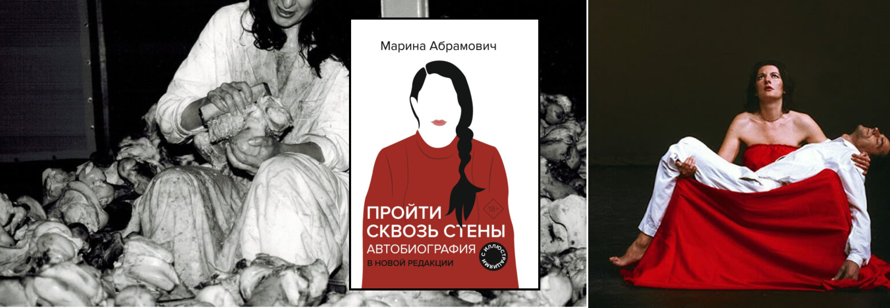
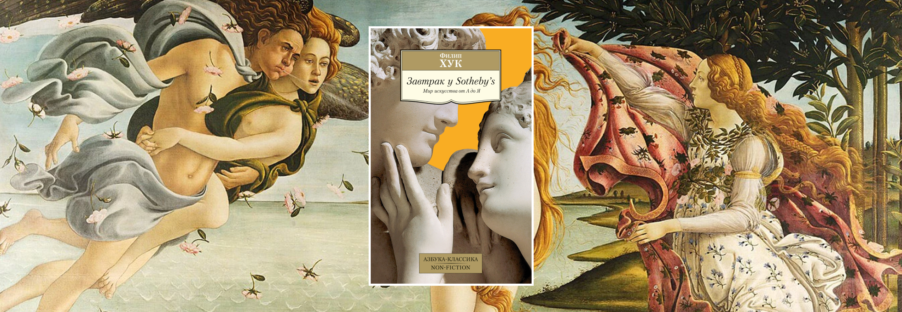

# Современное искусство – что почитать и на кого посмотреть

### **Теги**

книги 

### **Автор**

Justy

  

### Содержание

Алина Аксенова: История искусств. Просто о важном. Стили, направления и течения

Уилл Гомперц: Непонятное искусство. От Моне до Бэнкси

Искусство смотреть. Как воспринимать современное искусство

Марина Абрамович: Пройти сквозь стены. Автобиография

Филип Хук: Завтрак у Sotheby's. Мир искусства от А до 

### Современное искусство – одна из самых интересных и широко обсуждаемых тем. Искусство, вышедшее далеко за пределы привычного, ставшее актуальным и интеллектуальным. Неважно, в какой сфере вы дизайнер, ведь черпать вдохновение из современного искусства по силам любому, кто этого захочет. Главное – иметь азы. Именно этим азам и будет посвящена наша статья. Мы хотим представить 3 книги, которые помогут вам сделать шаг в этот непонятный мир🙃

### Под каждой книгой будут наши комментарии, как людей, прочитавших эти книги и прошедших этот путь

### Эту статью, а также многие другие вы можете прочитать в нашем [телеграм канале](https://t.me/justynews), чтобы ничего не пропустить и первыми узнавать все самое интересное❤️🫶

### Первое, и самое главное, что вам необходимо знать – это историю. Без знания истории искусства минимум с 18 века вам будет очень сложно понять, почему оно вышло так, как вышло. К сожалению, этот момент часто опускают при изучении, и поэтому все кажется таким странным и непонятным.

### Наш совет – потратить время на изучение истории искусств и открыть для себя мир современного искусства

## **Алина Аксенова: История искусств. Просто о важном. Стили, направления и течения**

Самая короткая книга про историю искусства от Древней Греции до наших дней. В книге много картинок, так что гадать, как выглядит произведение искусства вам не придется. 

С ней вы сможете разобраться в **истории** европейского **искусства**, научиться различать **стили**, **направления** и **течения**, а также понимать причины появления в искусстве тех или иных стилей.

## **Уилл Гомперц: Непонятное искусство. От Моне до Бэнкси**

Из прошлой книги вы узнали про импрессионизм, самое время двигаться дальше. Окунуться в атмосферу тех людей, кем создавалось современное искусство, познакомиться с личностями и понять их. Именно это вы сможете сделать в данной книге.

Большим плюсом является текстура книги, ее страницы очень приятно трогать, а сама книга содержит много картинок. Крайне советуем к приобретению

## **Искусство смотреть. Как воспринимать современное искусство**

Книга не объясняет появление современного искусства, но прекрасно говорит о его сути и и задачах. Эта книга написана критиком искусства, являясь по факту его записками о том, что он думает об искусстве

Сходство в названии с «Искусством видеть» Бергера неслучайно: Уорд действительно отсылает к этой книге, но в отличие от предшественника не дает оценок произведениям искусства, а предлагает читателю инструменты для взаимодействия с ними.

Для этого Уорд выделяет доминанты в творчестве художников: «развлечения» Джереми Деллара, «протест» Томаса Хиршхорна, «шутки» Натали Юрберг. Такой подход помогает начинающим зрителям глубже понимать идеи, которые высказывают в своих работах современные творцы.

## **Марина Абрамович: Пройти сквозь стены. Автобиография**

Кто еще может лучше рассказать о перформансе, если не его создательница? Лучшая книга для того, чтобы начать разбираться в перформансе.  Марина Абрамович – настоящий пионер в этом жанре, она начинала тогда, когда о зрелищном искусстве не шло и речи и 50 лет добивалась признания. Эта книга не только об искусстве, но и том, как не сдаваться, когда все идет против тебя 

## **Филип Хук: Завтрак у Sotheby's. Мир искусства от А до**

Книга о циничном ценообразовании в мире искусств. Что влияет на стоимость картины? Почему хороший хороший художник – мертвый художник? Как понять, что картина хороша? В чем задача арт-дилера? Какие картины мы покупаем на самом деле? Ответы на эти и многие другие вопросы в этой книге

Точно не подходит для начинающих, так как подразумевается, что вы уже знаете про арт-рынок, также практически нет картинок, а вот художников очень много. Каждого придется гуглить в таком случае