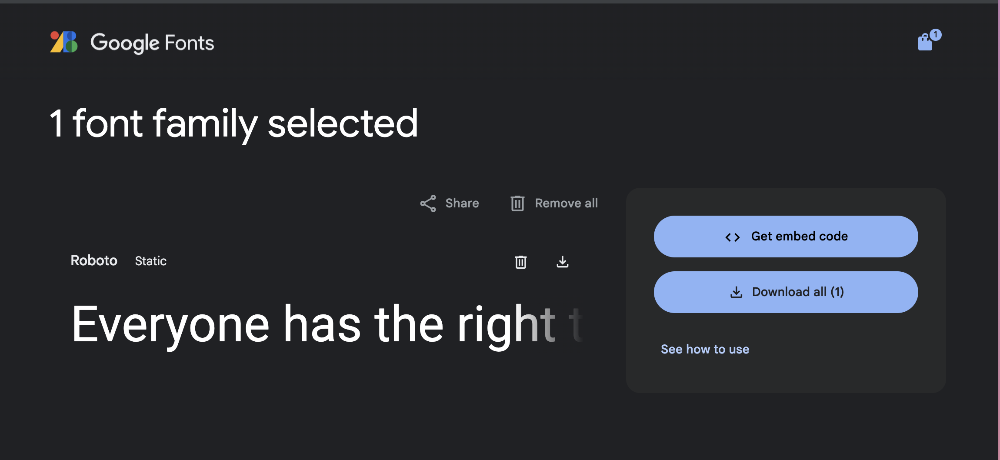
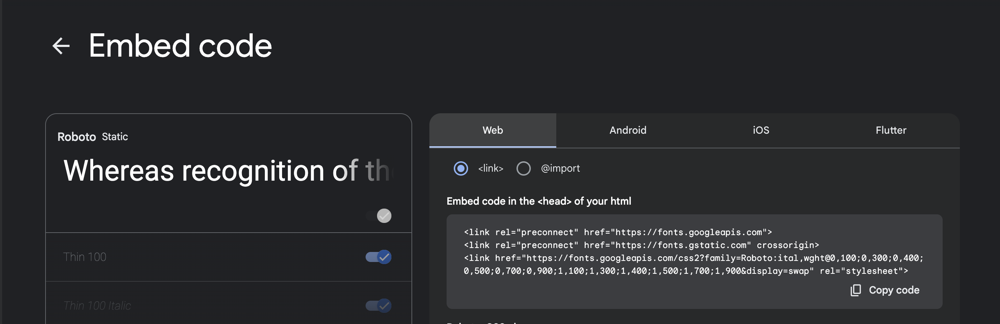

# Установка шрифтов

### Теги

css, html

### Автор

Саша Смыгина

### Источники

[https://htmlacademy.ru/blog/html/fonts-loading](https://htmlacademy.ru/blog/html/fonts-loading)

### Содержание

Введение 

Установка шрифтов с GoogleFont

Установка Кастомного шрифта для вашего проекта

 

### Шрифты играют важную роль в дизайне и восприятии текста для любого пользователя. Использование кастомных шрифтов позволяет выделить ваш проект и придать ему уникальный стиль. В этой статье мы рассмотрим, как установить кастомные шрифты на операционные системы Windows и macOS, а также как подключить шрифты из Google Fonts для использования на веб-сайтах и в приложениях. 

Почему эта тема так важна? Потому что не всегда понятно как устанавливать кастомные шрифты в ваш проект очень часто возникает с этим проблемы и не всегда знаешь как ее решить. В этой статье мы поможем вам со всем разобраться и упростить все до простых пары шагов! 

Если вы хотите получать еще больше такого контента, то переходите в наш телеграм канал, чтобы ничего не пропустить и первыми читать наши новости❤️🫶

## Установка шрифтов с GoogleFont

Начнем с того, что нужно разобраться, что такое Google Font и можно ли с него брать бесплатно шрифты? Да! Google Fonts — это очень популярный сервис, который предоставляет бесплатные шрифты для использования на веб-сайтах и в других проектах. Вы можете не беспокоиться на счет лицензии. В этой статье мы рассмотрим, как подключить шрифты из Google Fonts к вашему сайту, используя HTML и CSS.

### Шаг 1. Выбор шрифта

Для начала стоит вообще зайти на сам сайт [Google Fonts](https://fonts.google.com/). и посмотреть, что вы хотите выбрать и скачать шрифт, вы можете тут выбрать одно начертание, можете выбрать все

### **Шаг 2: Получение кода для подключения**

После выбора шрифта, в нижней части экрана появится панель с выбранными шрифтами. Нажмите на нее. 

В открывшемся окне выберите вкладку «Embed» и скопируйте предложенный HTML-код для подключения шрифта. Пример кода может выглядеть так:

Вы можете выбрать экспорт с помощью тега <link> или же @import чтобы вставить его сразу в ваш CSS код

> <link href="https://fonts.googleapis.com/css?family=Roboto" rel="stylesheet">
> 

если же говорить про импорт то это будет выглядеть так:

> @import url('https://fonts.googleapis.com/css2?family=Roboto:ital,wght@0,100;0,300;0,400;0,500;0,700;0,900;1,100;1,300;1,400;1,500;1,700;1,900&display=swap');

.text {
font-family: "Roboto", sans-serif;
font-weight: 100;
font-style: normal;
}
> 

### **Шаг 3: Подключение шрифта в HTML**

Откройте ваш HTML-документ, где вы будете подключать ваш выбранный вами шрифт, а также найдите внутри кода тег <head> туда мы и будем вставлять саму ссылку.

> <!DOCTYPE html>
<html lang="en">
<head>
<meta charset="UTF-8">
<meta name="viewport" content="width=device-width, initial-scale=1.0">
<title>Document</title>
<link href="https://fonts.googleapis.com/css?family=Roboto" rel="stylesheet">
</head>
</html>
> 

### **Шаг 4: Применение шрифта в CSS, если вы подключили через тег <link>**

Откройте ваш CSS-файл в вашем проекте и в дайте свойство **font-family** элементу body, также ваш шрифт будет использоваться во всем вашем проекте к любому вашему элементу. Также благодаря такому свойству как **font-weight** вы сможете изменять толщину вашего шрифта, а благодаря свойству **font-style** сможете сделать текст, италиком, жирным или оставить как есть.

Это все шаги! Теперь вы знаете и сможете подключить шрифты из Google Fonts к вашему проекту. Использование Google Fonts позволяет легко и быстро улучшить внешний вид вашего сайта, добавив красивые и разнообразные шрифты

## Установка Кастомного шрифта

### Шаг 1. Поиск шрифта

Начнем с того, что установка кастомного шрифта для вашего проекта немного сложнее чем с такого ресурса как GoogleFont, который предлагает <link> или @import, что значительно упрощает процесс установки шрифта в проект

### Шаг 2. Выбор правильного формата

Для начала вам стоит выбрать шрифт, который вы хотите установить в ваш проект и скачать их на ваше устройство. Стоит отметить, что файлы, которые поддержваются веб-браузерами и будут отображаться на вашем сайте .woff, .woff2, .ttf и поместите их в папку вашего проекта, чаще всего такую папку называют ”font”. 

### Шаг 3. Подключение в CSS

В файле стилей, который называется **style.css**, вам нужно использовать специальное правило **@font-face** для подключения нужного вам шрифта к вашему проекту. Вот пример того, как вы можете написать это все в коде: 

> @font-face {
font-family: 'MyCustomFont';
src: url('fonts/mycustomfont.woff2') format('woff2'),
url('fonts/mycustomfont.woff') format('woff'),
url('fonts/mycustomfont.ttf') format('truetype');
font-weight: normal;
font-style: normal;
}
> 

Так в сможете подключить любой шрифт к вашему проекту и он будет работать, смотрите работоспособности шрифта в таких браузерах, как Chrome, Safari некорректно работает и отображается шрифты в браузере. 

### Шаг 4. Применить шрифт к элементам на вашем сайте

Дальше вам нужно прописать такое свойство как font-family к тому элементу, к которому вы хотите подключить шрифт

> body {
font-family: 'MyCustomFont';
}
> 

### Шаг 5. Оптимизация

Но зачем мы прописываем после нашего шрифта через запятую “sans-serif” или просто “serif”? Это нужно для оптимизации загрузки шрифта? Если ваш шрифт не подключится, то будет отображаться любой шрифт относящийся к “sans-serif” или “serif”

> body {
font-family: 'MyCustomFont', ‘sans-serif’;
}
> 

Также есть еще один способ для оптимизации шрифта и это его предзагрузка, то есть предварительная загрузка шрифта на ваш проект с ее помощью вы сообщаете своему проекту о том, что шрифты нужно загрузить в самую первую очередь.

Стоит учитывать также то, что браузер загрузит шрифт в любом случае — даже если он не используется на странице. И, обладая высоким приоритетом, эта загрузка может блокировать загрузку других ресурсов, поэтому нужно грамотно выбирать, что именно предзагружать. Например, если на странице используются три разных шрифта, стоит предзагрузить только основной шрифт без дополнительных начертаний, чтобы не произошел конфликт. 

Для того, чтобы предзагрузка сработала, нужно поместить в тег **<head>**  ссылку на шрифт и задать атрибуту **rel** значение **preload**:

> <link rel="preload" href="https://htmlacademy.ru/fonts/roboto.woff2" as="font">
> 

В конце вы указываете тип того, что в хотите предзагрузить в нашем случае это шрифт, поэтому мы прописываем **font.** Таким образом можно загружать разные файлы, например как: изображения

### Тестирование

Проверьте в подходящем браузере работоспособность вашего шрифта, мы рекомендуем вам проверять в таких браузерах, как Chrome, Safari  как мы упомянали ранее некорректно работает и отображается шрифты в браузере

Следуя этим шагам, вы сможете успешно установить и использовать кастомные шрифты в вашем проекте, улучшив его визуальную привлекательность и уникальность

Надеюсь вам это помогло, Удачи!