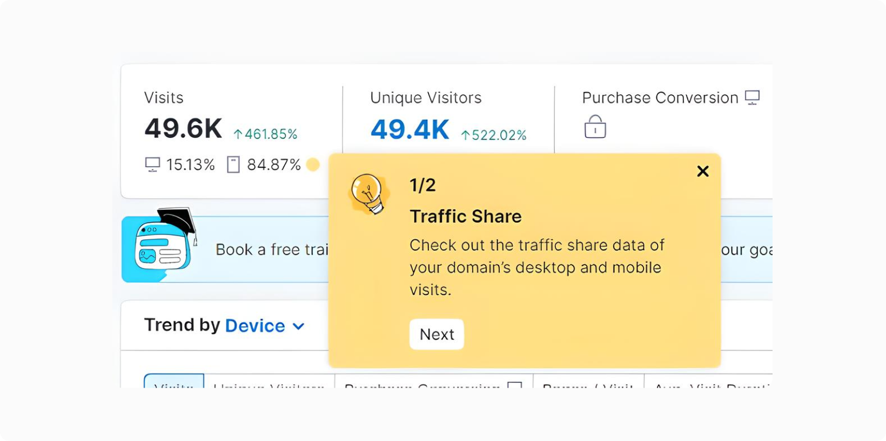
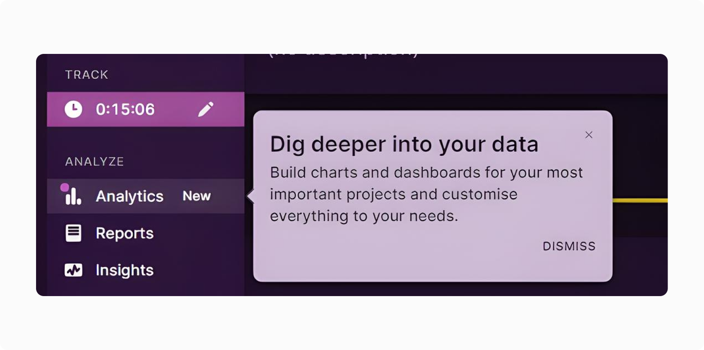
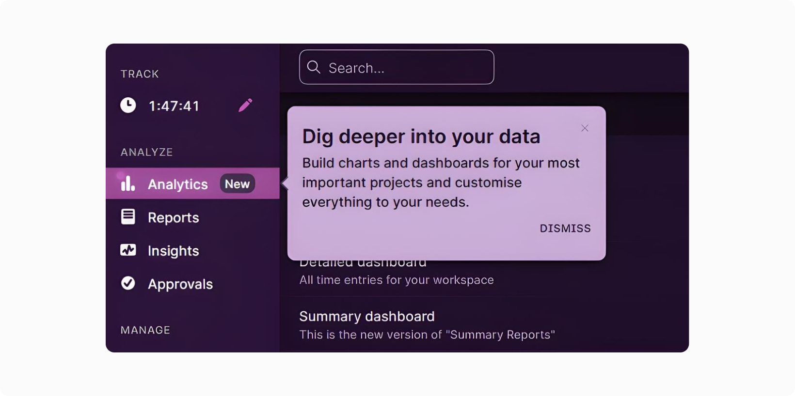
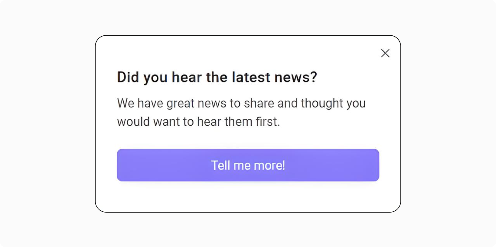
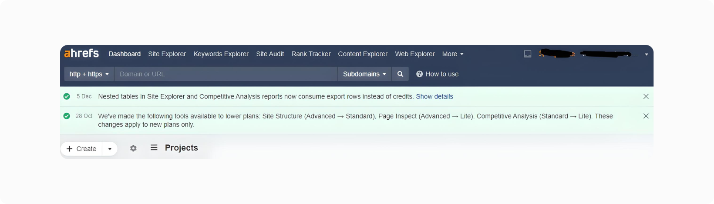
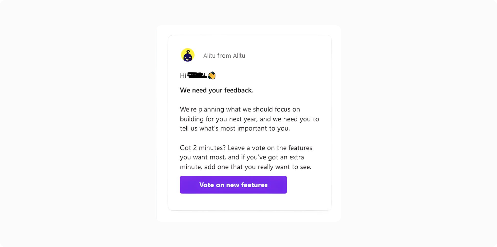
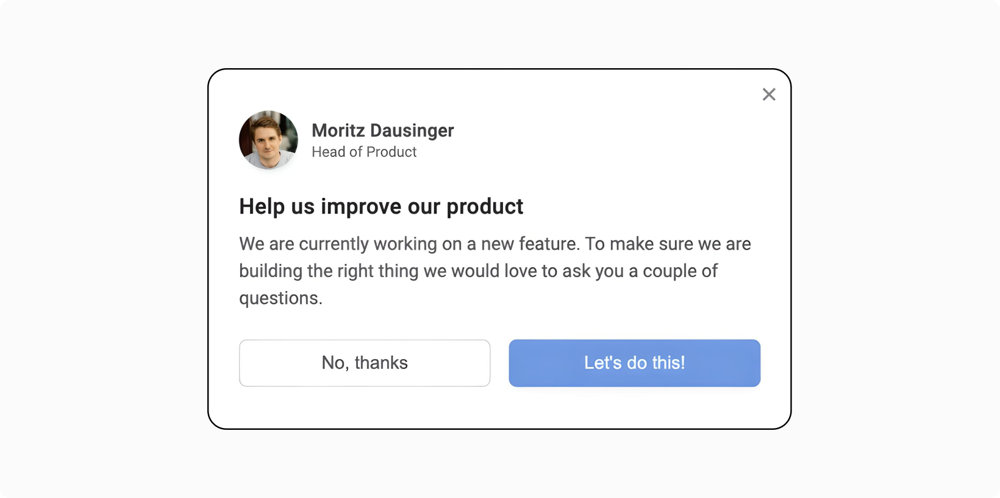

# Что такое уведомления в приложении и почему вы должны их использовать

### **Теги**

ux

### **Автор**

Мориц Даузингер

### **Источники**

[https://refiner.io/blog/in-app-notifications/](https://refiner.io/blog/in-app-notifications/)

### **Содержание**

Что такое уведомления в приложении?

Зачем использовать уведомления в приложении? Что вы можете получить, запустив уведомления в приложении?

Различные типы уведомлений в приложении

### Я знаю, это прозвучит грубо, но я должен спросить: *вы когда-нибудь использовали продукт SaaS, который в тот или иной момент не показывал вам уведомления в приложении?*

### Я тоже.

### Конечно, я не говорю, что все используют уведомления в приложении, это далеко не так. Во-первых, скорее всего, вы читаете это руководство именно потому, что еще не использовали уведомления в приложении и хотите их реализовать. Но все же запуск уведомлений в приложении - довольно распространенная практика в SaaS.

### В этом руководстве вы узнаете, как использовать их и в вашем продукте.

## **Что такое уведомления в приложении?**

Я признаю, что сам термин – ***уведомления в приложении*** – может раскрывать практически все. Потому что что еще это может означать, как не уведомление или сообщение, которое вы показываете в приложении, верно?

Что ж, если это то, о чем вы тоже подумали, тогда бинго. Вы попали в точку.

Браво!

Уведомление в приложении - это не что иное, как [сообщение в приложении,](https://refiner.io/blog/in-app-messaging-guide/) которое вы запускаете и показываете в приложении пользователям, которые прямо сейчас взаимодействуют с продуктом.

Вот пример уведомления в приложении. Обратите внимание, как компания использует среду для информирования пользователей о новых функциях и улучшениях, которые они недавно запустили.

**Но в приведенном мною определении есть кое-что, что я должен уточнить.** Видите ли, я подозреваю, что фраза “*прямо сейчас*” может немного вводить в заблуждение.

Когда я говорю “*прямо сейчас”, я не имею в виду время, когда вы* запустили уведомление. В данном случае “*прямо сейчас*” относится к моменту, когда пользователь входит в приложение и начинает в нем работать.

Потому что, если подумать, для них уведомление появилось на экране “*прямо сейчас*”, когда они делали все, что делали в вашем продукте. И это при том, что с момента запуска кампании прошло несколько часов.

В моем определении есть еще одна фраза, которую мне, вероятно, нужно уточнить – “*не более чем*”.

Обычно подобная фраза может звучать так, как будто она принижает ценность того, что она описывает. Здесь это не так. Я использую ее буквально. Уведомление в приложении - это буквально уведомление, сообщение, которое ваши пользователи видят в приложении. Вот и все.

Но это не значит, что это что-то незначительное или меньшее, чем любое объявление, которое вы отправляете по другим каналам.

Отнюдь. На самом деле, как вы вскоре увидите, обычное уведомление в приложении может нанести гораздо более серьезный удар, чем многие другие сообщения и маркетинговые каналы.

### **Но сначала позвольте мне показать вам еще пару примеров уведомлений в приложении**

Во-первых, давайте начнем с двух примеров простых уведомлений. В одном рассказывается о часах работы службы поддержки в праздничные дни; другой рассказывает пользователю больше о функциональности нового продукта. Взгляните.

Но на самом деле, прежде чем я увидел это уведомление в своей учетной записи, компания также предоставила мне простую всплывающую подсказку. Это потому, что эта конкретная функциональность изменилась, и компания хотела, чтобы я знал об этом. Вот как выглядит всплывающая подсказка. Обратите внимание, что за ней можно увидеть вышеупомянутое объявление.

А это объявление о новой функции в моем приложении для отслеживания времени.

Конечно, существуют и другие типы уведомлений в приложении, и я объяснил их в другом разделе ниже.

На данный момент нам нужно рассмотреть еще один вопрос…

### **Разве эти уведомления не то же самое, что push-уведомления?**

Нет, это не так. Но я признаю, что довольно легко спутать одно с другим, поэтому позвольте мне прояснить это сейчас.

Давайте начнем со сходств (потому что именно это заставляет многих людей путать уведомления в приложении и [push-уведомления](https://www.ibm.com/topics/push-notifications) друг с другом.)

Итак, как уведомления в приложении, так и push-уведомления:

- Помогайте компаниям предоставлять информацию пользователям.
- Предложите компаниям способ привлечь и своих пользователей.
- Не говоря уже о том, что оба этих типа уведомлений помогают компаниям общаться с пользователями в режиме реального времени (помните проблему “прямо сейчас”, которую мы обсуждали ранее?)

Но между ними есть тонкая разница.

**Как видите, уведомления в приложении запускаются ВНУТРИ приложения. Push-уведомления запускаются ВНЕ продукта.**

Подумайте сами - Push-уведомления обычно отображаются на дисплее вашего смартфона, не так ли?

Они сообщают вам о чем-то новом, произошедшем в приложении. Они уведомляют вас о новом сообщении. Они предоставляют вам дополнительную информацию или статистику, которые могут понадобиться вам в данный момент.

Но они исчезают, когда вы возвращаетесь к продукту.

Вы можете видеть уведомления в приложении только при повторном входе в продукт. Их нигде нет, что касается дисплея вашего телефона или экрана блокировки. Но снова войдите в приложение, и вы обязательно увидите там уведомление в приложении.

Я признаю, что разница между ними скорее техническая, чем что-либо еще. Но это влияет на то, как вы используете каждое уведомление.

- Push-уведомления идеально подходят для привлечения пользователей, которые в данный момент не используют приложение. Фактически, это отличный способ вернуть их к работе с продуктом.
- Уведомления в приложении, с другой стороны, являются идеальным каналом для привлечения пользователей, которые в данный момент находятся в продукте.

Как я уже сказал, это тонкое различие, но его тоже важно понимать.

Это подводит нас к следующему пункту…

## **Зачем использовать уведомления в приложении? Что вы можете получить, запустив уведомления в приложении?**

Я думаю, лучше всего начать эту часть нашего обсуждения с того, что сделать шаг назад, потому что легко начать думать о уведомлениях в приложении как о самостоятельном канале или стратегии.

Это не так.

Я не могу представить, чтобы кто-нибудь запускал уведомления в приложении ради этого.

Обычно стратегия является частью чего-то большего ....

**Ранее в этом году я опубликовал подробное руководство (очень похожее на это) по [росту, основанному на продуктах](https://refiner.io/blog/product-led-growth/).**

Я уверен, что вы знакомы с этой концепцией, но если нет, то мое руководство - отличное начало.

Короче говоря, рост, ориентированный на продукт, ставит продукт в центр целей вашей организации, способствуя приобретению, вовлечению и удержанию.

Другими словами, ваш рост определяется продуктом, а не командой продаж.

**Какое это имеет отношение к уведомлениям в приложении?** Что ж, как вы сразу увидите, уведомления в приложении помогают достичь целого ряда типичных целей роста, основанных на продукте.

### **# 1. Уведомления в приложении помогают привлекать пользователей**

Посмотрите на примеры уведомлений в приложении, которыми я поделился выше. Обратите внимание, сколько из них было разработано для привлечения пользователей этих продуктов. (Обратите внимание, вскоре мы рассмотрим список различных способов сделать это с помощью данной стратегии.)

Они что-то говорят пользователям. Эти уведомления помогают им лучше использовать продукт. Они представляют новые функции или могут даже намекнуть на то, что еще больше заинтересует пользователей продуктом.

Короче говоря, они предоставляют вам способ взаимодействовать с вашими пользователями и открывают для вас прямой канал связи.

### **# 2. Уведомления в приложении = гораздо лучший пользовательский интерфейс**

Я признаю, что UX - довольно часто используемый термин. Многие люди используют его во всем, что связано с продуктом. Но есть и причина, по которой они это делают (хотя я могу не согласиться с последующим рассуждением) – UX имеет решающее значение для роста, ориентированного на продукт. Фактически, я рискую сказать, что без этого роста не будет.

Но UX также невероятно сложен, и одной из причин этого является отсутствие прямого канала связи, о котором я упоминал выше.

Уведомления в приложении могут выступать в качестве такого канала и помогать вам поддерживать пользователей и улучшать их общее взаимодействие.

### **# 3. Уведомления в приложении помогают бороться с оттоком (большое время!)**

Отток - это… ну, отток. Он есть, и нам, основателям SaaS, это не нравится. Но мы также можем попытаться бороться с этим, и уведомления в приложении предоставляют нам способ.

Ключ к этому, опять же, кроется во фразах “вовлеченность” и “пользовательский опыт”.

С помощью уведомлений в приложении вы можете своевременно отправлять пользователям обновления. Или покажите новые функции, укажите им на другие функции, которые они, возможно, пропустили, решите их проблемы, просветите их и сделайте практически все остальное, чтобы обеспечить их успех при использовании продукта.

Я знаю, я знаю, кажется несбыточной мечтой удерживать таких пользователей, но это действительно работает.

### **# 4. Уведомления в приложении также помогают новым пользователям**

Уведомления в приложении могут помочь вам познакомить новых пользователей с пользовательским интерфейсом вашего продукта. С помощью этих уведомлений вы можете познакомить их и побудить попробовать определенные функции, а затем постепенно передавать информацию о других возможностях вашего продукта. Все для того, чтобы получить их в этот момент “ага” и достичь [точки активации](https://userlist.com/blog/saas-user-activation/).

### **# 5. Уведомления в приложении - это лучший способ уведомлять, возбуждать и повышать продажи пользователей**

Мы редко рассматриваем их как коммуникационные цели, но это правда – иногда вы просто хотите что-то сказать пользователям. Сообщение может быть таким же обыденным, как, например, уведомление о плановом техническом обслуживании. Или краткую информацию о новой публикации в блоге, которую вы опубликовали, о новой инициативе, которую вы предпринимаете, и т.д.…

Не имеет значения, что это. Важно то, что нет лучшего способа сообщить пользователям об этом, чем когда они уже взаимодействуют с приложением.

### **# 6. Наконец, уведомления в приложении дают вам представление об интересах, болевых точках и поведении вашего пользователя**

Вы знаете, часто мы в основном думаем о том, что получаем, отправляя то или иное сообщение нашим пользователям.

Но, как обычно, у этой монеты есть и другая сторона – данные, которые вы получаете, отслеживая, как пользователи взаимодействуют с сообщением.

И давайте посмотрим правде в глаза, вы можете извлечь немало полезного, наблюдая за такими вещами, как то, какие сообщения привлекают ваших пользователей больше всего, когда они взаимодействуют с этими сообщениями, какие места размещения работают лучше всего и так далее.

Такие данные о производительности могут стать сокровищницей информации о ваших пользователях. Информацию, которую вы действительно нигде больше не сможете получить.

## **Различные типы уведомлений в приложении**

Давайте обратим наше внимание на более осязаемые аспекты уведомлений в приложении.

Во-первых, хотя может показаться иначе, существует несколько типов таких сообщений, которые вы можете отображать.

**Ваше уведомление в приложении может быть всплывающей подсказкой**, указывающей кому-либо на определенный аспект пользовательского интерфейса.

**Вы также можете отобразить всплывающее окно** со своим сообщением и настроить его отображение в разных частях интерфейса.

**Вы могли бы использовать баннер для информирования пользователей о ваших новостях.** В этом примере представлен не один, а два баннера с разными объявлениями.

**Другой распространенный тип** уведомлений в приложении - это виджет, подобный этому. Кстати, если для вас это очень похоже на виджет живого чата, вы попали в точку. Эти уведомления в приложении часто имеют похожую форму. Более того, многие продукты для онлайн-чатов включают возможность запускать уведомления как часть своих виджетов.

**Уведомления в приложении также идеально подходят для проведения опросов.** Фактически, опросы, вероятно, являются наиболее распространенным содержанием уведомлений в приложении после регистрации пользователя.

## **И это все…**

Это все, что нужно знать об уведомлениях в приложении. Осталось попробовать стратегию самостоятельно.

Удачи!