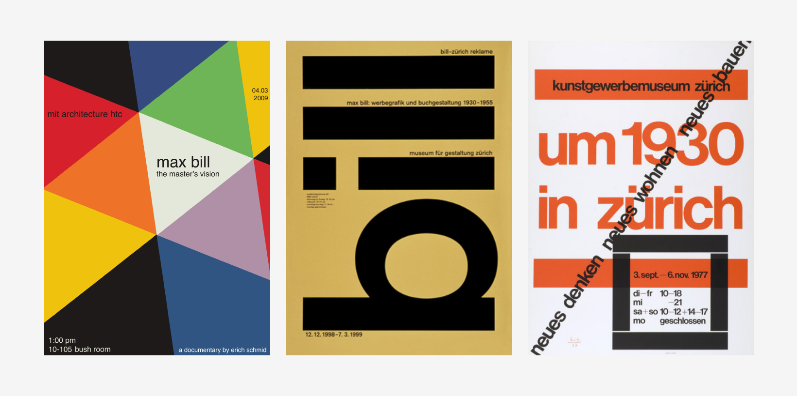

# Швейцарский стиль в типографике? Почему все так любят его?

### **Теги**

типографика

### **Автор**

[**Callie Budrick**](https://www.printmag.com/author/callie-budrick/)

### **Источники**

[https://www.printmag.com/featured/swiss-style-principles-typefaces-designers/](https://www.printmag.com/featured/swiss-style-principles-typefaces-designers/)

### **Содержание**

Принципы 

Шрифты 

Akzidenz-Grotesk

Univers

Helvetica

The Designers

### Если вы дизайнер 21 века, то, скорее всего, вы изучали международный типографский стиль (более известный как "швейцарский стиль’). Давайте уделим немного внимания некоторым из наиболее влиятельных принципов современного дизайна, шрифтам и художникам, которые положили начало этому центральноевропейскому направлению.

## Принципы

### Чистоплотность. Удобочитаемость. Объективность.

Всего несколько ключевых слов, которые описывают движущую силу швейцарского стиля. 19 век ознаменовался отделением дизайна от изобразительного искусства, а вместе с ним и рождением дизайна, основанного на сетке.

Филип Б. Меггс‘ История графического дизайна объясняет, что международный типографский дизайн начинается с математической сетки. Эти сетки считаются “наиболее удобочитаемым и гармоничным средством структурирования информации”. Использование сетки в дизайне значительно упрощает создание иерархии контента — подумайте о веб-дизайне. Почему так много веб-сайтов разбиты на сетки? Сетки являются гибкими, последовательными и за ними легко следить. Они четко сформулированы и хорошо сочетаются с соотношениями (правило третей, золотое сечение и т.д.). В дополнение к сетке, швейцарский стиль обычно предполагает асимметричную компоновку, шрифты без засечек и предпочтение фотографии перед иллюстрациями.

Новаторы движения объединили элементы других художественных направлений, чтобы создать красоту и простоту швейцарского стиля, который мы знаем сегодня. Элементы Баухауза, стиля Де Стайл и Новой типографики присутствуют в работах Эрнеста Келлера, Макса Билла, Йозефа-Мюллера Бракманна и Армина Хофмана — пионеров швейцарского стиля.

## Шрифты

Ценить швейцарский стиль - значит ценить шрифты, с которых все началось. Эти сетчатые системы не были бы чем-то особенным без классического шрифта без засечек, который так органично вписывается в швейцарский стиль. Те, кто преподавал швейцарский стиль, утверждали, что дизайн должен быть сосредоточен на содержании, а не на декоративных дополнениях. Избавляясь от украшений, швейцарский стиль устраняет отвлекающие факторы для зрителя и позволяет читать и изучать насыщенный информацией дизайн, а не просто рассматривать его и восхищаться им. Именно поэтому для воплощения швейцарского стиля были выбраны шрифты, которые действительно отражают один из ключевых принципов этого движения:

## Akzidenz-Grotesk

Вероятно, самый влиятельный шрифт этого направления, Akzidenz-Grotesk, был выпущен литейным заводом Бертольда в 1896 году и, возможно, стал первым в своем роде. Вскоре он стал одним из наиболее широко используемых шрифтов и даже продавался в США под названиями “Стандартный” или “Базовый коммерческий”. Если это не означает “ПЕРВЫЙ!” Я не знаю, что происходит.

## **Univers**

Адриан Фрутигер, один из самых влиятельных дизайнеров шрифтов XX века,

создал Universe в 1954 году. Используя элементы Akzidenz-Grotesk, компания Frutiger создала одну из первых гарнитур, которая сформировала семейство шрифтов, позволяющее использовать в документах один шрифт (вместо нескольких) различных размеров и весовых категорий, создавая красивую и простую унификацию только с помощью текста. Первоначально выпущенная компанией Danberry & Peignot в 1957 году, эта серия прошла через руки литейного цеха Haas Type Foundry, а затем была приобретена в 2007 году (вместе со всем Linotype) компанией Monotype.

## **Helvetica**

Когда Макс Мидингер и Эдуард Хоффманн в 1957 году создавали Helvetica, знали ли они, что результатом их работы станет, пожалуй, самый распространенный в мире шрифт без засечек? Скорее всего, нет. Неужели они хоть на мгновение подумали, что их шрифт вдохновит на создание фильма? И снова, скорее всего, нет. Но вот, почти 60 лет спустя, рейтинг свежести на сайте Rotten Tomatoes составил 88%, а Саймон Гарфилд назвал Helvetica “повсеместной, потому что она отвечает многим требованиям современного стиля”.

## **The Designers**

Эрнст Келлер, которого с любовью называют “отцом швейцарского дизайна”. Сейчас 1918 год, и Келлер только что получил должность преподавателя в Kunstgewerbeschule (буквально переводится как "школа искусств и ремесел”) в Швейцарии. Его учение положило начало созданию сетчатых систем, благодаря которым известен швейцарский стиль, а его вера в то, что дизайн должен адаптироваться к содержанию, сделала акцент на важности шрифтов. Келлер и не подозревал, что некоторые из его учеников станут лидерами международного движения за создание типографского стиля. Назовем ли мы их сынами швейцарского стиля?

Армин Хофманн вместе с Эмилем Рудером основал Школу дизайна в 1947 году. Хофманн начал преподавать, и его часто считали неортодоксальным в своих взглядах. Большая часть его работ была сосредоточена на элементах графической формы, оставаясь при этом простыми и объективными. В своих композициях, созданных под влиянием учения Эрнста Келлера, он часто использовал типографику, а не иллюстрации. Учебная программа Хофмана была несколько адаптирована, но по сей день преподается в Школе дизайна в Базеле, Швейцария.

Йозеф Мюллер-Брокман, еще один ученик Келлера, в своей работе уделял большое внимание системе grid и шрифту Akzidenz-Grotesk. После того как Мюллер-Брокманн занял должность преподавателя в Художественной школе Келлера, а затем открыл собственную дизайнерскую фирму, он помог распространить швейцарскую эстетику далеко за пределами Европы, основав журнал "Neue Grafik" (Новый графический дизайн) — трехъязычный журнал, который он редактировал совместно с Франко Виварелли, Хансом Нойбергом и Ричардом Полом. Лозе.

Примерно в 125 милях к северо-востоку от школы дизайна Хофмана и Рудера Макс Билл и Отл Айхер открыли свою собственную школу в Ульме, Германия. Билла, который известен не только своей работой в качестве дизайнера, но и своими теоретическими трудами и связью с современным движением, часто считают самым “решающим фактором, оказавшим влияние на швейцарский графический дизайн”. Его школа в Ульме включала курсы семиотики, или изучения знаков и символов. Эти учения соответствуют объективности и удобочитаемости Международного типографского стиля, который направлен на создание контента, легко узнаваемого и понятного любому, кто его просматривает.

Сетки, без засечек и фотографии — вот это да! Швейцарский стиль распространился по всему миру и продолжает вдохновлять художников и дизайнеров каждый день. Вы мне еще не верите? Просто спросите Сайруса Хайсмита, который пытался провести день без Гельветики в Нью-Йорке, но понял, что это было почти невозможно. Использование Helvetica, возможно, и не определяет международный типографский стиль, но его повсеместное присутствие является постоянным напоминанием о том влиянии, которое радикальные швейцарцы оказывают на нашу повседневную жизнь. Спасибо, ребята, за то, что сделали нашу жизнь немного более организованной.